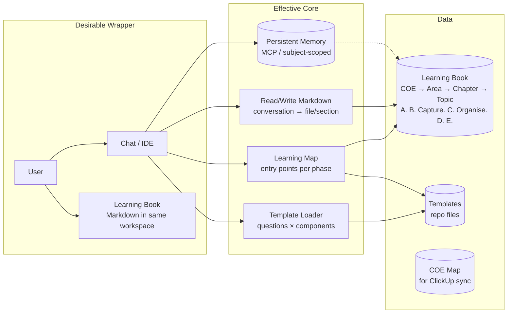

# 1. THE SYSTEM DESIGN (Context & Bridge)
*Approved in State A Sub-Step 2. Source: `docs/ai/requirements/feature-integrated-learning-environment.md`.*
* **Subject Roadmap (A) as UDO anchor** (learning and entry-point presentation informed by current level L1–L7 so the user can respect level-appropriate progression and avoid scattered learning).
* **Principles (Why):** Hierarchy over chronology; active recall and deep questioning; single persistent context; documentation as byproduct; one environment; you are the author; consumption in-scope, digestion out-of-scope; 
* **Environment (Where):** Digital, local-first. Learning Book = Markdown repo (COE → Area → Chapter → Topic). Per subject: A. Subject Roadmap, B. Capture Facts & Data, C. Organise Information (UBS, UDS, EPS, UES, EOP…), D. Distill Understanding, E. Express Expertise. Interfaces: Cursor Chat / AntiGravity; optional later: NotebookLM-like (Audio, Infographics, Quiz) with exploration beyond given sources.
* **Tools (What):** Desirable Wrapper = integrated learning conversation (phase A/B/C, entry-point choice, template-driven). Effective Core = persistent memory + real-time Markdown update + template loading (questions × components) + Learning Map entry points.
* **SOP (How):** (1) Start area (COE → Area → Chapter → Topic); (2) Agent asks phase A/B/C and presents entry points; (3) User selects entry → template loads; (4) Learning conversation, doc updates in real time; (5) Optional distill (Phase D); (6) Progress/roadmap; (7) Digestion outside system.

### 1.1 Persistent Memory & Context Storage

| What | Where it lives | Notes |
|------|----------------|--------|
| **AEL hierarchy** (COE → Area → Chapter → Topic, phases A/B/C, components) | **Repo files** (templates, config, or `docs/ai/`) | Canonical, versioned; Agent reads when needed. Not in MCP memory. |
| **Templates** (questions × components, Distilled Table structure) | **Repo files** | Single source of truth. |
| **LTC COE map** (for ClickUp mapping) | **Repo files or config** | Defined structure. |
| **Subject learning content** (what the user has written in the Book) | **Markdown Learning Book** | Source of truth; Agent reads/writes these files. |
| **Resume / session context** (current subject, last entry point) | **Optional: MCP persistent memory** (e.g. `@ai-devkit/memory`) | Enables "where we left off" without re-reading the whole Book. |
| **First-principles / venture rules** (e.g. from `/remember`) | **MCP persistent memory** | Cross-session knowledge for the Agent. |

So: persistent memory does **not** store the full hierarchy or all templates; it **can** store subject/session pointers and high-level knowledge for continuity across sessions.

### 1.2 Subject Roadmap (A) as UDO Anchor

**A** (Subject Roadmap & Level Specifications) defines the target mastery levels (L1–L7 SFIA), requirements, and recommended learning sources per subject. It is the **UDO anchor**: learning that respects A is level-appropriate and sequenced; ignoring A leads to scattered learning (e.g. L4 content while still at L1/L2/L3). The ILE must:

* **Surface A:** Let the user see their current level and the relevant part of A (e.g. level requirements, next-step recommendations) so they can consciously respect it.
* **Inform entry points:** Use the user's current level and A to prioritise or suggest level-appropriate entry points in the Learning Map; the user can still choose any entry point.
* **Assess progress:** Use A to assess growth, identify gaps, and plan next steps (SOP step 6).

So: A is not only "where we store the roadmap" but the **reference for what the user should respect** so learning stays on track.

### 1.3 Reusability: other spaces and template sets

The ILE pattern (Capture → Organise → Distill with AI Agent; template-driven; sync to a defined location) is **generic**. The current use case (COE Learning Book, AEL templates, sync to LTC COE ClickUp space) is **one configuration**. The same setup can later be applied to:

* **Other ClickUp spaces** (e.g. project management, sales, operations — not COE), each with its own hierarchy and member/location mapping.
* **Different doc template sets** (different phases, entry points, questions × components) stored as config or repo files.

To support this, **hierarchy**, **templates**, and **ClickUp space mapping** must be **configurable** (e.g. per workspace or per "mode"), not hard-coded to COE and AEL. Then the core integration (chat + memory + real-time doc update + template load + sync) stays the same; only the config changes.

### 1.4 Usage analytics (I4, options open)

The product owner (or ILE operator) must be able to obtain **quality data from ILE usage** so that **Descriptive, Diagnostic, Predictive, and Prescriptive analytics** can be applied to drive future feature development and bug fixes (ScalAdv-AC5, Noun-AC10). Data sources and implementation remain open; the design accommodates, for example: (1) **A + Session Log** as the primary source of truth (session frequency, entry points, checkpoints, level progression); (2) optional **event stream** (e.g. session start/end, EOP step reached, checkpoint done); (3) **sync pipeline** (e.g. when syncing to ClickUp, same pipeline can feed an analytics store); (4) **vocal feedback** as first-class input (e.g. explicit feedback event). Consent and purpose (e.g. "improve ILE, not performance evaluation") are design constraints. No single implementation is mandated in design; options are to be chosen in I4.

### 1.5 Learner engagement (I3 light, I4 full)

**Goal:** Clear completion moments and visible progress so learners return daily (Cursor-style task-completion loop), without adding mandatory steps (Verb-AC9, Verb-AC10, EffAdv-AC4, EffAdj-AC4, EffAdj-AC5, Noun-AC11, Noun-AC12).

* **I3 — Engagement light (T-304):** Agent behavior only. After each chunk (e.g. one component or entry point completed), the Agent delivers a **completion moment** (explicit confirmation; optional lightweight reward). The Agent can surface a **progress summary in chat** (e.g. "X of Y completed for this phase"). No new UI; no mandatory steps. Data source: same as Session Log / A (what’s completed per phase/entry).
* **I4 — Engagement full (T-405, T-406):** Optional **dedicated UI** for progress, entry points, and stats (Duolingo-style dashboard). Optional **stats, achievements, streaks** (e.g. completed entry points, daily return). In-conversation progress remains sufficient for minimum engagement; dedicated UI and stats are additive and optional to consume.

---

# 2. TECHNICAL ARCHITECTURE (The Noun)
*First pass from Requirements and Planning; refined in State B as we implement each iteration.*

* **Feature Noun:** ILE = IDE (or OpenClaw) + Master Effective Learning Template + integration (see requirements Phase 3). One workspace: conversation (chat) + structural document (Learning Book Markdown repo). Core: persistent memory, real-time Markdown update, template loading, Learning Map (and optionally Subject Roadmap A).

## 2.1 Visual Map (Mermaid)

*Flow:* User chooses phase (A/B/C) and entry point in chat → Learning Map returns entry points for that phase (informed by Subject Roadmap A where available) → User selects entry → Template Loader loads template (questions × components) and scopes context → User and Agent conduct learning conversation → DocWrite updates Learning Book Markdown as byproduct. Persistent Memory holds session/subject context and optional first-principles.

## 2.2 Component Mapping

* **Wrapper Implementation:** The Wrapper is the IDE (Cursor or later OpenClaw) with (1) **Chat** — user and Agent converse; user states phase (B. Capture Facts & Data | C. Organise Information | D. Distill Understanding) and selects entry point from a list presented by the Agent; (2) **Structural document** — Learning Book lives as Markdown files in the same workspace (e.g. open folder or file tree); user does not switch to another app to edit the Book. The "UI" is conversational (phase choice, entry-point choice) plus direct file access in the same workspace. No separate dashboard in I1–I3; optional UI later (e.g. sidebar with Learning Map) in I4.
* **Core Implementation:** (1) **Persistent memory** — MCP (e.g. `@ai-devkit/memory`) or equivalent; Agent stores/recalls context keyed by current subject or Learning Book path; used for "where we left off" and optional first-principles from `/remember`. (2) **Real-time Markdown update** — Agent, as part of the conversation flow, reads and writes Markdown files under the Learning Book path; mapping rule: current phase + entry point + conversation scope → target file and section (e.g. `C. Organise Information/1. UBS - 3. Principles.md`). (3) **Template loading** — Templates live as repo files (e.g. Markdown or config); when user selects an entry point, Agent loads the corresponding template (structure: headers = questions, rows = components) and scopes the conversation and any doc write to that entry. (4) **Learning Map** — Derived from repo structure and/or config (COE → Area → Chapter → Topic; phases A/B/C; list of entry points per phase); Agent presents entry points for the chosen phase; optionally informed by Subject Roadmap (A) for level-appropriate ordering. (5) **Subject Roadmap (A) surfacer** — When A is present (e.g. `A. Subject Roadmap & Level Specifications` for the subject), Agent can read and surface current level and recommendations so user can respect level-appropriate progression.

## 2.3 Data Models & APIs

* **Learning Book (folder/file structure):** One root per COE Area (or per subject). Under each root: `A. Subject Roadmap & Level Specifications` (optional); `B. Capture Facts & Data`; `C. Organise Information` (with components e.g. 0. Overview, 1. UBS, 2. UDS, 3. EPS, 4. UES, 5. EOP); `D. Distill Understanding`; `E. Express Expertise`. Same path always resolves to the same logical place (SustainAdv-AC1). Files are Markdown; naming follows `[OWNER]_SUBJECT - section` or equivalent. No database in I1–I3; filesystem is the store.
* **Template structure:** Each template is a known structure: e.g. table or section list with headers = questions, rows/sections = components (Overview, Blockers, Drivers, Principles, etc.). Stored as repo files (Markdown or config); Template Loader resolves entry point → template path/content.
* **COE map (for ClickUp sync, I4):** Representation of LTC COE hierarchy: COE → Chapter → Topic → Topic Members' Learning Area → each member's Personal Learning Area. Stored as config or repo file; used to map user + topic → ClickUp location for sync. No external API in I1–I2; ClickUp API or integration in I4 (sync to company space).
* **APIs / interfaces:** (1) Agent ↔ filesystem: read/write Learning Book Markdown. (2) Agent ↔ MCP: store/recall (e.g. `memory.storeKnowledge`, recall by key/tag). (3) Agent ↔ template config: resolve entry point → template content. (4) Optional later: Agent ↔ ClickUp API for sync (I4). All interfaces are local or existing (IDE, MCP, file I/O) in I1–I3; no new hosted backend.
* **Usage analytics (I4, options open):** To support Noun-AC10 and ScalAdv-AC5, the system will support (or will support) **data collection and data management** of usage data so that Descriptive, Diagnostic, Predictive, and Prescriptive analytics can be applied. Design accommodates: A + Session Log (and optional structured fields) as primary source; optional event stream (session/step/checkpoint/error/feedback); sync pipeline as analytics feed; vocal feedback as first-class event. Storage, schema, and consent flow are not fixed; implementation to be chosen in I4.

---

# 3. EFFECTIVENESS ATTRIBUTES (The Adjectives)
*How the feature attributes enable the user to reach the Effectiveness Outcomes.*

*Map each attribute below to the corresponding Requirements A.C. IDs and to the Planning iteration where that A.C. is validated. Design defines how; Requirements and Planning define what and when.*

* **Sustainability (Risk/Safety):** Structure-faithful — SustainAdj-AC1..AC3. *Validated in:* Iteration 2 (Working Prototype).
  * **Exact Implementation Strategy:** (1) All writes to the Learning Book go through a single logical path: Agent writes only to paths that match the defined hierarchy (COE → Area → Chapter → Topic) and phase structure (A/B/C); path resolution is deterministic from current subject + phase + entry point. (2) Template loading reads only from canonical repo files; component set (Overview, UBS, UDS, EPS, UES, EOP) and question set are defined in template config—no ad hoc structure at runtime. (3) A check script or manual step verifies that the repo folder structure and key files still match the expected layout after updates; run on demand or before marking a task done.

* **Efficiency (Speed/Utility):** Zero-friction capture — EffAdj-AC1..AC3. *Validated in:* Iteration 3 (MVE).
  * **Exact Implementation Strategy:** (1) No separate "export" or "copy from chat and paste into doc" step: Agent writes to Markdown as part of the same conversation turn (e.g. after user confirms or at end of a logical chunk); the mechanism is "conversation scope → target file/section → write". (2) Updates are triggered by the conversation (Agent proposes write or user says "save"; trigger is explicit and repeatable). (3) When user switches entry point or phase, in-progress context for the current entry is either retained in session (e.g. draft in memory) or committed to the doc (written to Markdown) before the switch so no loss of draft.

* **Scalability (Growth):** Template-driven — ScalAdj-AC1..AC4. *Validated in:* Iteration 4 (Leadership).
  * **Exact Implementation Strategy:** (1) New subjects reuse the same Learning Book template (same folder layout A., B. Capture Facts & Data, C. Organise Information, D., E.); adding a subject = new root folder + same structure. (2) New entry points or template variants are added via config or new repo files; core integration (chat + memory + doc read/write) does not change—only the template and Learning Map config. (3) Optional capabilities (e.g. Audio Overview, Infographics, Quiz) are additive modules or external tools; core flow (phase → entry → template → conversation → doc update) remains unchanged. (4) Hierarchy, templates, and ClickUp space mapping are configurable (e.g. per workspace or mode) so the same ILE code can drive other ClickUp spaces and different doc template sets; config holds COE map, template paths, and optional sync target.
* **Usage analytics (I4, options open):** ScalAdv-AC5, Noun-AC10. *Validated in:* Iteration 4 (Leadership).
  * **Implementation strategy (options open):** (1) Product owner can obtain quality data from usage (incl. vocal feedback) for Descriptive, Diagnostic, Predictive, Prescriptive analytics to drive features and bug fixes. (2) Data sources may include: A + Session Log (and optional structured fields) as primary; optional event stream (session, step, checkpoint, error, feedback); sync pipeline as analytics feed. (3) Data collection and management must be robust enough to support the four analytics types; consent and purpose (e.g. improve ILE, not performance evaluation) are constraints. (4) Exact mechanism (storage, schema, ETL) is not fixed in design; to be chosen in I4.

---

# 4. RESOURCE IMPACT (The "Price Tag")
*First-pass estimates from Requirements and Planning. Update when architecture or scope changes.*

* **Financial Cost (OpEx):** **$0/month** for I1–I3. Cursor/IDE and local file I/O are existing; MCP (e.g. `@ai-devkit/memory`) is used in-process or free tier. No hosted backend or paid API required for Concept, Working Prototype, or MVE. I4 (sync to ClickUp) may incur cost if ClickUp API is rate-limited or paid—request User approval per Design §4 before committing.
* **Build Complexity:** **Medium.** IDE integration (Cursor/OpenClaw), file-based Learning Book, MCP for memory, template loading from repo, and optional COE map config. No custom server or database in I1–I3; complexity is in clear mapping rules (conversation → file/section) and consistent structure.
* **ROI Sanity Check:** **Yes.** The architecture respects the Principle of Efficiency: eliminates manual copy-paste (zero-friction capture), reuses existing IDE and MCP, and keeps the Learning Book as plain Markdown (no lock-in). Build is incremental (Concept → Prototype → MVE → Leadership) so spend is aligned with validated risk.

*Ongoing tracking:* See Planning §3 (Resource & Budget Tracker) for current usage vs limits.

**Requesting Resources / Budget from the User (optional):** When the design or execution requires a budget increase, new tool, or paid service:
1. **When to ask:** Before committing to a task that exceeds current limits (e.g. new API, hosting, paid tier). Do not assume; request explicit approval.
2. **What to specify:** Amount or ceiling (e.g. $X/month, Y API calls/day), purpose (which A.C. or task it serves), and alternative if the User says no.
3. **Approval gate:** Do not spend or integrate until the User approves. Record the approved limit in Planning §3 (Hard Limit) and proceed. If the User declines, adjust scope or task (e.g. mark 🟠 Stuck and propose an alternative).

---

*Last updated: Aligned with template 1.1.0. Planning: `docs/ai/planning/feature-integrated-learning-environment.md`. Full design (§2–4) refined in State B.*
