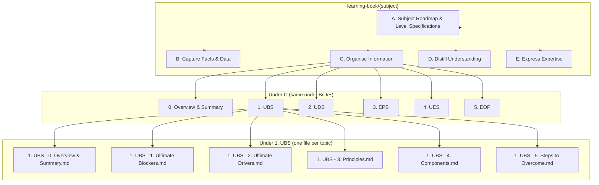
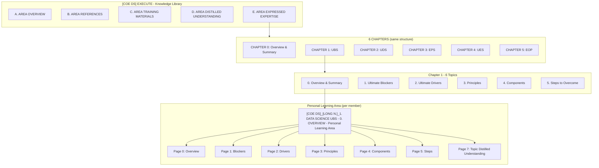

# COE Effective Learning — Full Tree Map

*One diagram to align on: Area → Chapters → Topics → Pages. Source: E. DATA SCIENCE - AREA EXPRESSED EXPERTISE, user templates, and ClickUp structure.*

**COE hierarchy (company-side):** The single source of truth for the LTC COE hierarchical map (COE → Area → Chapter → Topic → Topic Members' Learning Area → Personal Learning Area) is **`config/coe-map.yaml`**. See `ile-coe-map.md`. This doc describes the tree for alignment; structural details (areas, chapters, topics, PLAs) live in the config.

**Two views in this doc:** (1) **Individual's full effective learning tree** (§ below) — the folder/file structure that **one person's** Learning Book contains (`learning-book/`). This is what the ILE repo holds and what T-202 conversation→doc mapping targets. (2) **Company tree** (§ Mermaid and § Tree Map) — where each member's learning sits in the org (ClickUp, COE); per-member branches.

**Cross-references:** Flow → `docs/ai/implementation/ile-minimal-flow.md` | Entry→Template → `docs/ai/implementation/entry-point-to-template-mapping.md` | Conversation→Doc → `docs/ai/implementation/ile-conversation-to-doc-mapping.md` | Folder layout → `learning-book/README.md`

---

## Individual's full effective learning tree (learning-book/ for one person)

*The `learning-book/` folder in the ILE repo contains **solely** one individual's content: one Area (e.g. COE_DS) with phases A/B/C/D/E and under each phase the Chapter → Topic → Pages (files) for that person. There is no "per member" branching here—this is one person's full effective learning tree. The Agent (T-202) resolves conversation scope (subject, phase, entry point) → target file path using this structure. See `ile-conversation-to-doc-mapping.md`.*

### Individual tree: Mermaid (one Area, one person)




*Flow: Subject (e.g. COE_DS) → Phase (A/B/C/D/E) → Chapter folder (0..5) → one file per (chapter, topic). **Entry point** = (chapter, topic, **page**) — a particular page within a topic; page ∈ {0,1,2,3,4,5,7}. Entry point maps to exactly one file + one section (page/component) in this tree (T-202). Chapter folder names use short form per `learning-book/README.md`: 1. UBS, 2. UDS, 3. EPS, 4. UES, 5. EOP.*

### Individual tree: folder structure (one Area, one person)

```
learning-book/{subject}/   e.g. learning-book/COE_DS/
├── A. Subject Roadmap & Level Specifications/
│   └── [COE DS]_[OWNER]_A. DATA SCIENCE - SUBJECT ROADMAP & LEVEL SPECIFICATIONS.md
├── B. Capture Facts & Data/
│   ├── 0. Overview & Summary/
│   ├── 1. UBS/
│   ├── 2. UDS/
│   ├── 3. EPS/
│   ├── 4. UES/
│   └── 5. EOP/
├── C. Organise Information/
│   ├── 0. Overview & Summary/
│   │   └── (one file per topic, or one file 0-overview-and-summary.md)
│   ├── 1. UBS/
│   │   ├── 1. UBS - 0. Overview & Summary.md
│   │   ├── 1. UBS - 1. Ultimate Blockers.md
│   │   ├── 1. UBS - 2. Ultimate Drivers.md
│   │   ├── 1. UBS - 3. Principles.md
│   │   ├── 1. UBS - 4. Components.md
│   │   └── 1. UBS - 5. Steps to Overcome.md
│   ├── 2. UDS/
│   ├── 3. EPS/
│   ├── 4. UES/
│   └── 5. EOP/
├── D. Distill Understanding/
└── E. Express Expertise/
```

*One individual's Learning Book = one Area root with A/B/C/D/E; under each phase, chapter folders (0..5); under each chapter, one file per topic; **each topic file has exactly 7 pages (Layer 6)** as sections: Page 0 … Page 5 + Page 7 Topic Distilled Understanding. No per-member branches; this is the tree the Agent uses for read/write (T-202).*

### Company vs Individual: 

**Company tree (one member [LONG N.]):** Area → Chapter → Topic → **Personal Learning Area (PLA)** → **7 Pages**. The PLA is the per-member container for that topic; inside it are **7 pages** (Page 0 … Page 5 + **Page 7: Topic Distilled Understanding**). When merging to the company tree, **Distilled Understanding lives in every Topic** as Page 7 within that topic's PLA, not only at Area/Chapter Phase D.

**Individual tree:** Area (subject) → Phase (A/B/C/D/E) → Chapter folder → **Topic file** → **Layer 6: 7 pages (as sections within the file)**. The individual has no separate "PLA" folder—the whole `learning-book/` is that person's content, so the **Topic file** is the direct equivalent of the company's **Topic → PLA [member]**; **each topic file has exactly 7 pages**: Page 0, Page 1, Page 2, Page 3, Page 4, Page 5, **Page 7: Topic Distilled Understanding**. Do **not** rely on Phase **D. Distill Understanding** at the subject root for topic-level distilled content—when merging to the company tree, topic-level distilled is **Page 7 within each topic**. Phase D at individual root is for Chapter/Area-level distilled; Layer 6 Page 7 is per-topic. *Note: Topic 0 (Overview & Summary) may or may not have Page 7 per company rules; Individual tree can mirror that if needed.*

### Side-by-side: Company (one member) vs Individual — layers and names


| Layer                     | Company tree (one member, e.g. [LONG N.])                                                                                                                       | Individual tree (learning-book/)                                                                                                                                                                                        |
| ------------------------- | --------------------------------------------------------------------------------------------------------------------------------------------------------------- | ----------------------------------------------------------------------------------------------------------------------------------------------------------------------------------------------------------------------- |
| **1. Area**               | [COE DS]_EXECUTE - Knowledge Library (or COE DS Data Science Area)                                                                                              | `learning-book/COE_DS/` (subject root)                                                                                                                                                                                  |
| **2. Phase**              | A/B/C/D/E at Area level (e.g. C. [COE DS]_DATA SCIENCE - AREA TRAINING MATERIALS)                                                                               | `A. Subject Roadmap & Level Specifications/`, `B. Capture Facts & Data/`, `C. Organise Information/`, `D. Distill Understanding/`, `E. Express Expertise/`                                                              |
| **3. Chapter**            | CHAPTER 0: OVERVIEW & SUMMARY OF DATA SCIENCE, CHAPTER 1: ULTIMATE BLOCKING SYSTEM (UBS), … CHAPTER 5: EOP                                                      | Under C: `0. Overview & Summary/`, `1. UBS/`, `2. UDS/`, `3. EPS/`, `4. UES/`, `5. EOP/`                                                                                                                                |
| **4. Topic**              | TOPIC 0. OVERVIEW & SUMMARY, TOPIC 1. ULTIMATE BLOCKERS, TOPIC 2. ULTIMATE DRIVERS, TOPIC 3. PRINCIPLES, TOPIC 4. COMPONENTS, TOPIC 5. STEPS TO OVERCOME        | One file per topic under chapter folder: `1. UBS - 0. Overview & Summary.md`, `1. UBS - 1. Ultimate Blockers.md`, … `1. UBS - 5. Steps to Overcome.md`                                                                  |
| **5. PLA (Company only)** | [COE DS]_[LONG N.]_1. DATA SCIENCE UBS - 0. OVERVIEW & SUMMARY - Personal Learning Area                                                                         | *No separate layer* — the Topic **file** is the individual's PLA for that topic                                                                                                                                         |
| **6. 7 Pages**            | Page 0: Overview & Summary, Page 1: Blockers, Page 2: Drivers, Page 3: Principles, Page 4: Components, Page 5: Steps, **Page 7: Topic Distilled Understanding** | **Individual: same 7 pages** as sections within each topic file (Page 0 … Page 5, **Page 7: Topic Distilled Understanding**). Do not use Phase D at subject root for topic-level distilled—Page 7 is inside each topic. |


### Counts (one Area, phase C, one person)


| Level                             | Company (one member [LONG N.])         | Individual (learning-book/COE_DS/)                      |
| --------------------------------- | -------------------------------------- | ------------------------------------------------------- |
| **Area**                          | 1                                      | 1 (subject root)                                        |
| **Chapters**                      | 6 (0. Overview … 5. EOP)               | 6 (folder names 0. Overview & Summary … 5. EOP)         |
| **Topics**                        | 6 × 6 = 36 (6 per chapter)             | 36 (one file per topic per chapter)                     |
| **PLA**                           | 36 (one PLA per topic for that member) | 0 as folder — 36 topic **files** = 36 “PLA equivalents” |
| **Pages**                         | 36 × 7 = 252 (7 pages per PLA)         | 252 (7 **sections** per topic file)                     |
| **Total content nodes (C phase)** | 1 + 6 + 36 + 36 + 252 = 331            | 1 + 6 + 36 + 252 = 295 (no PLA layer)                   |


### Individual tree — full depth (Area → Chapter → Topic → 7 Pages) with names

*Same depth as Company for one member: every Company node has a precise Individual counterpart. Page names match § 6 Pages per Topic.*

```
learning-book/COE_DS/   ← Area (subject)
└── C. Organise Information/   ← Phase
    └── 1. UBS/   ← Chapter (CHAPTER 1: ULTIMATE BLOCKING SYSTEM)
        └── 1. UBS - 0. Overview & Summary.md   ← Topic file (= Company: Topic → PLA [LONG N.])
            ├── Page 0: Overview & Summary   ← section
            ├── Page 1: Ultimate Blockers   ← section
            ├── Page 2: Ultimate Drivers   ← section
            ├── Page 3: Principles   ← section
            ├── Page 4: Components   ← section
            ├── Page 5: Steps to Overcome   ← section
            └── Page 7: Topic Distilled Understanding   ← section
        └── 1. UBS - 1. Ultimate Blockers.md
            ├── Page 0: Overview & Summary
            ├── Page 1: Ultimate Blockers
            ├── Page 2: Ultimate Drivers
            ├── Page 3: Principles
            ├── Page 4: Components
            ├── Page 5: Steps to Overcome
            └── Page 7: Topic Distilled Understanding
        … (same 7 pages for topics 2, 3, 4, 5)
    └── 2. UDS/
        └── (same: one file per topic, each file has 7 page sections)
    … (chapters 0, 3, 4, 5 same pattern)
```

**Page names (same in Company and Individual, per § 6 Pages per Topic):**


| Page  | Name (UBS chapter example)        | Name (UDS chapter: "Steps to Utilize") |
| ----- | --------------------------------- | -------------------------------------- |
| 0     | Overview & Summary                | Overview & Summary                     |
| 1     | Ultimate Blockers                 | Ultimate Blockers                      |
| 2     | Ultimate Drivers                  | Ultimate Drivers                       |
| 3     | Principles                        | Principles                             |
| 4     | Components                        | Components                             |
| 5     | Steps to Overcome                 | Steps to Utilize                       |
| **7** | **Topic Distilled Understanding** | **Topic Distilled Understanding**      |


*Mapping:* Company’s “Topic → PLA [LONG N.] → 7 Pages” = Individual’s “Topic **file** → 7 **sections** (pages)”. Entry point (chapter, topic, **page**) in Individual = that topic file + that page (section). **Topic Distilled Understanding = Page 7 within each topic** in both Company and Individual; do not rely on Phase D at subject root for topic-level distilled.

---

## Mermaid Diagram (One Area) — Company view




*Flow: Personal Learning Area (Pages 0–5 → Page 7 Topic Distilled Understanding) → Chapter D (per member) → Chapter E (per member) → Area D (per member) → Area E (per member).*

---

## Tree Map (One Area, e.g. Data Science) — Company view

```
[COE DS]_EXECUTE - Knowledge Library
│
├── A. [COE DS]_DATA SCIENCE - AREA OVERVIEW
├── B. [COE DS]_DATA SCIENCE - AREA REFERENCES
├── C. [COE DS]_DATA SCIENCE - AREA TRAINING MATERIALS
├── D. [COE DS]_DATA SCIENCE - AREA DISTILLED UNDERSTANDING
│   ├── [COE DS]_[MEMBER 1]_D. Personal Excellence Area Distilled Understanding
│   ├── [COE DS]_[LONG N.]_D. Personal Excellence Area Distilled Understanding
│   └── … (one per member)
└── E. [COE DS]_DATA SCIENCE - AREA EXPRESSED EXPERTISE
    ├── [COE DS]_[MEMBER 1]_E. Personal Excellence Area Expressed Expertise
    ├── [COE DS]_[LONG N.]_E. Personal Excellence Area Expressed Expertise
    └── … (one per member)
    │
    │   ═══════════════════════════════════════════════════════════════
    │   6 CHAPTERS (same structure per Chapter)
    │   ═══════════════════════════════════════════════════════════════
    │
    ├── CHAPTER 0: OVERVIEW & SUMMARY OF DATA SCIENCE
    │   ├── A. CHAPTER ROADMAP & LEVEL SPECIFICATIONS
    │   ├── B. CHAPTER REFERENCES
    │   ├── C. CHAPTER TRAINING MATERIALS
    │   ├── D. CHAPTER DISTILLED UNDERSTANDING
    │   │   ├── [COE DS]_[MEMBER]_0. DATA SCIENCE - D. Personal Chapter Distilled Understanding
    │   │   └── … (one per member)
    │   ├── E. CHAPTER EXPRESSED EXPERTISE
    │   │   ├── [COE DS]_[MEMBER]_0. DATA SCIENCE - E. Personal Chapter Expressed Expertise
    │   │   └── … (one per member)
    │   └── TOPIC 0. OVERVIEW & SUMMARY
    │       ├── 0. OVERVIEW - TOPIC TRAINING
    │       ├── 0. OVERVIEW - TOPIC EXAMPLES
    │       └── 0. OVERVIEW - TOPIC MEMBERS (Personal Learning Area)
    │           ├── [COE DS]_[LONG N.]_0. DATA SCIENCE - 0. OVERVIEW & SUMMARY - Personal Learning Area
    │           └── … (one per member)
    │
    ├── CHAPTER 1: ULTIMATE BLOCKING SYSTEM (UBS)
    │   ├── A. CHAPTER ROADMAP & LEVEL SPECIFICATIONS
    │   ├── B. CHAPTER REFERENCES
    │   ├── C. CHAPTER TRAINING MATERIALS
    │   ├── D. CHAPTER DISTILLED UNDERSTANDING
    │   │   ├── [COE DS]_[MEMBER 1]_1. DATA SCIENCE UBS - D. Personal Chapter Distilled Understanding
    │   │   ├── [COE DS]_[LONG N.]_1. DATA SCIENCE UBS - D. Personal Chapter Distilled Understanding
    │   │   └── … (one per member)
    │   ├── E. CHAPTER EXPRESSED EXPERTISE
    │   │   ├── [COE DS]_[MEMBER 1]_1. DATA SCIENCE UBS - E. Personal Chapter Expressed Expertise
    │   │   ├── [COE DS]_[LONG N.]_1. DATA SCIENCE UBS - E. Personal Chapter Expressed Expertise
    │   │   └── … (one per member)
    │   └── 6 TOPICS (each with 6 pages + Page 7 Topic Distilled Understanding)
    │       ├── TOPIC 0. OVERVIEW & SUMMARY
    │       │   └── [COE DS]_[LONG N.]_1. DATA SCIENCE UBS - 0. OVERVIEW & SUMMARY - Personal Learning Area
    │       │       └── 7 PAGES: 0–5 (Overview, Blockers, Drivers, Principles, Components, Steps) + Page 7: Topic Distilled Understanding
    │       ├── TOPIC 1. ULTIMATE BLOCKERS
    │       ├── TOPIC 2. ULTIMATE DRIVERS
    │       ├── TOPIC 3. PRINCIPLES
    │       ├── TOPIC 4. COMPONENTS
    │       └── TOPIC 5. STEPS TO OVERCOME
    │
    ├── CHAPTER 2: ULTIMATE DRIVING SYSTEM (UDS)  ← same structure as Chapter 1
    │   ├── A/B/C/D/E (Chapter level)
    │   └── 6 TOPICS (0. Overview, 1. Blockers, 2. Drivers, 3. Principles, 4. Components, 5. Steps to Utilize)
    │       └── [COE DS]_[LONG N.]_2. DATA SCIENCE UDS - 0. OVERVIEW & SUMMARY - Personal Learning Area
    │
    ├── CHAPTER 3: EFFECTIVE PRINCIPLE SYSTEM (EPS)
    ├── CHAPTER 4: ULTIMATELY EFFECTIVE SYSTEM (UES)
    └── CHAPTER 5: EFFECTIVE OPERATING PROCEDURE (EOP)
```

---

## Counts (One Area)


| Level                                        | Count                                                                            |
| -------------------------------------------- | -------------------------------------------------------------------------------- |
| **Area**                                     | 1 (e.g. Data Science)                                                            |
| **Chapters**                                 | 6 (0. Overview, 1. UBS, 2. UDS, 3. EPS, 4. UES, 5. EOP)                          |
| **Topics per Chapter**                       | 6 (0. Overview, 1. Blockers, 2. Drivers, 3. Principles, 4. Components, 5. Steps) |
| **Pages per Topic (Personal Learning Area)** | 7 pages: 0–5 (content) + Page 7 (Topic Distilled Understanding)                  |
| **Total Topics**                             | ~30 core topics (6 chapters × ~5 topics, or 6×6 depending on Chapter 0)          |


---

## Naming Convention (Personal Learning Area)

```
[COE AREA]_[MEMBER NAME]_[CHAPTER ID]. [CHAPTER NAME] - [TOPIC ID]. [TOPIC NAME] - Personal Learning Area
```

**Example:** `[COE DS]_[LONG N.]_1. DATA SCIENCE UBS - 0. OVERVIEW & SUMMARY - Personal Learning Area`


| Part                     | Meaning                |
| ------------------------ | ---------------------- |
| `[COE DS]`               | Group Owner (COE Area) |
| `[LONG N.]`              | Owner (Member)         |
| `1. DATA SCIENCE UBS`    | Chapter ID + Name      |
| `0. OVERVIEW & SUMMARY`  | Topic ID + Name        |
| `Personal Learning Area` | Folder/Item type       |


---

## Canonical Questions (Headers)

*Same question set across Organise and Distilled levels. Column counts: Organise = 16 (14 questions + 2 notes); Distilled = 17 (14 questions + 3 notes). "Other Questions (Others)" appears only in Distilled Understanding and Expressed Expertise.*

### 1. What is it for? Why is it important? (Relevance)

### 2. SUCCESS

- How does it work successfully? (Success Actions)
- What ultimately causes it to work successfully? (Ultimate Drivers)
- How do the ultimate drivers cause it to work successfully? (Success Mechanism)
- What principles are the ultimate drivers based on? (Success Principles)
- What tool(s) do the ultimate drivers require to work? (Success Tools)
- What environmental conditions do the ultimate drivers require to work? (Success Environment)

### 3. FAILURE

- How can it fail? (Failure Actions)
- What ultimately causes it to fail? (Ultimate Blockers)
- How do the ultimate blockers cause it to fail? (Failure Mechanism)
- What principles are the ultimate blockers based on? (Risky Principles)
- What tool(s) do the ultimate blockers require to work? (Risky Tools)
- What environmental conditions do the ultimate blockers require to work? (Risky Environments)
- What to do if it fails? (What else?)
- **Other Questions (Others)** — *only in Distilled Understanding and Expressed Expertise*
- Next Steps to Take (Now What? Now How?)

---

## Rule: Hierarchy of Science

*When learning any Area, Chapter, or Topic, answer the canonical questions with **full respect to the Hierarchy of Science**. This enables the tree of knowledge to be mapped indefinitely and supports progression to L7 SFIA and lifelong learning.*

**Order (most complex → most fundamental):**  
Sociology → Psychology → Biology → Chemistry → Physics → Mathematics → Logic → Philosophy

**Why it flows this way:**

- Sociology is governed by Psychology (the behaviour of individuals)
- Psychology is governed by Biology (the functions of the brain)
- Biology is governed by Chemistry (the reactions of molecules)
- Chemistry is governed by Physics (the interaction of matter and energy)
- Physics is governed by Mathematics (the quantitative laws of the universe)
- Mathematics is governed by Logic (the rules of valid reasoning)
- Logic is a branch of Philosophy (the study of existence, knowledge, and ethics)

*Source: [Hierarchy of the sciences (Wikipedia)](https://en.wikipedia.org/wiki/Hierarchy_of_the_sciences)*

**Guidance for Agents and Learners:** Structure answers according to this hierarchy. Trace phenomena to their governing layer (e.g. a behavioural pattern → psychological mechanism → biological substrate → chemical process → physical law). This discipline prevents scattered learning and supports deterministic mapping of knowledge.

---

## 6 Pages per Topic (same headers, different rows)


| Page                                 | Row label (example for UBS)  | Row label (example for UDS) |
| ------------------------------------ | ---------------------------- | --------------------------- |
| 0. Overview & Summary                | THE ULTIMATE BLOCKING SYSTEM | THE ULTIMATE DRIVING SYSTEM |
| 1. Ultimate Blocking System          | ULTIMATE BLOCKER #1..#5      | ULTIMATE BLOCKER #1..#5     |
| 2. Ultimate Driving System           | ULTIMATE DRIVER #1..#5       | ULTIMATE DRIVER #1..#5      |
| 3. Principles                        | (Principles rows)            | (Principles rows)           |
| 4. Components                        | (Component rows)             | (Component rows)            |
| 5. Steps to Apply                    | (Steps rows)                 | (Steps rows)                |
| **7. Topic Distilled Understanding** | (sub-topics 1.0–1.5)         | (sub-topics 2.0–2.5)        |


---

## Phase C Organise — content rules (do not override)

*When generating or reviewing Phase C (Organise Information) content, Agents and Learners must follow these rules. They prevent greedy generation, format drift, and content that does not build causally on prior approved pages.*

### Row and depth

1. **One concept per row.** Each row has exactly one blocker (UBS) or one driver (UDS) or one principle or one component or one step. Do not list multiple blockers, drivers, or principles in a single row.
2. **Causal chain, not a list.** Each row builds on the previous. For UBS/UDS pages: a row's col 10 (UBS) reveals what becomes the next row (UBS.UB); a row's col 4 (UDS) reveals UDS.UD for the next row. The table is a derivation chain, not a flat list of related items.
3. **Topic 0 = overview depth.** Page 0 and Topic 0 pages use overview depth only. Do not front-load everything into the overview. Deeper layers (more rows, more specific causation) belong in Topics 1–5.
4. **Topics 1–5 = one recursive layer deeper.** Each deeper topic expands one level (e.g. parent.UB, parent.UB.UB, parent.UB.UD). Do not skip layers or merge layers.

### Principles (Page 3)

5. **Principles derive from UBS and UDS only.** Harvest from cols 6 and 12 of P0+P1+P2 of the same topic. Do not invent generic best practices. Each principle must explicitly "Enables [UDS element]" or "Disables [UBS element]".
6. **No new principles.** All principles on Page 3 come from harvesting existing pages; do not add principles that are not traceable to a prior row's Success EPS or Failure EPS.

### Components (Page 4 — UES)

7. **Three causal layers, fixed order.** Components must be ordered: Layer 1 (e.g. Infrastructure) first, Layer 2 (e.g. Workspace) second, Layer 3 (e.g. Intelligence) last. Do not reorder or skip a layer. Layer names are subject-specific (e.g. INFRA, WORKSPACE, INTEL for AI Orchestration).
8. **Each component traces to at least one Principle.** Every row on Page 4 must be traceable to a Principle from Page 3 of the same topic. Do not add components that do not implement a stated principle.

### Notation and perspective

9. **UBS/UDS dot-notation only.** Use UBS.UB, UBS.UD, UDS.UD, UDS.UB and their recursions (e.g. UBS.UB.UB). Do not use UBS1, UBS2, UDS1, UDS2.
10. **Row subject determines col 4 and col 10 meaning.** For a UBS row: col 4 = UBS.UD (drives the blocker — works against Learner); col 10 = UBS.UB (disables the blocker — works for Learner). For a UDS row: col 4 = UDS.UD (drives the driver — works for Learner); col 10 = UDS.UB (blocks the driver — works against Learner). Do not swap these.

### Format and process

11. **Pure markdown tables only.** Use markdown tables with the canonical 17 columns (1 row label + 16 questions). Do not use HTML tables. Include the Column Key and Perspective Rule above the table.
12. **Page 0 for Topics 1–5 = copy parent.** Do not regenerate. T1.P0 = copy of T0.P1; T2.P0 = copy of T0.P2; etc. Copy the file and rename.

*Reference: For template paths and derivation rules per page type, see `entry-point-to-template-mapping.md`. For state (Approved Pages, Current state, Decisions), see A (Subject Roadmap) Phase C section.*

---

## Knowledge Flow: Capture → Organise → Distill → Express


| Phase        | Where                                                    | What                                               |
| ------------ | -------------------------------------------------------- | -------------------------------------------------- |
| **Capture**  | Topic's Personal Learning Area (Pages 0–5)               | Raw facts, information, sources                    |
| **Organise** | Topic's Personal Learning Area (Pages 0–5)               | Structure into templates (questions × components)  |
| **Distill**  | Page 7: Topic Distilled Understanding                    | Condense 6 pages into sub-topics (1.0–1.5)         |
| **Distill**  | Chapter D: Personal Chapter Distilled Understanding      | Condense 6 topics into Chapter-level understanding |
| **Express**  | Chapter E: Personal Chapter Expressed Expertise          | Articulate Chapter-level expertise                 |
| **Distill**  | Area D: Personal Excellence Area Distilled Understanding | Condense 6 chapters into Area-level understanding  |
| **Express**  | Area E: Personal Excellence Area Expressed Expertise     | Articulate Area-level expertise                    |


*Flow: Topic (Capture/Organise in PLA) → Page 7 (Topic Distilled) → Chapter D (Personal Chapter Distilled) → Chapter E (Personal Chapter Expressed) → Area D (Personal Area Distilled) → Area E (Personal Area Expressed).*

---

## Flow (Summary)

1. **Capture & Organise** in Topic's Personal Learning Area (Pages 0–5).
2. **Distill** into Page 7 (Topic Distilled Understanding).
3. **Distill** into Chapter D: `[COE DS]_[LONG N.]_1. DATA SCIENCE UBS - D. Personal Chapter Distilled Understanding`.
4. **Express** at Chapter E: `[COE DS]_[LONG N.]_1. DATA SCIENCE UBS - E. Personal Chapter Expressed Expertise`.
5. **Distill** into Area D: `[COE DS]_[LONG N.]_D. Personal Excellence Area Distilled Understanding`.
6. **Express** at Area E: `[COE DS]_[LONG N.]_E. Personal Excellence Area Expressed Expertise`.

---

## Content Addressing: Do We Need an "Address" or "Postal Code" per Block?

**Answer: Yes.** Each content block needs a deterministic address so the Agent and Learner know exactly where it belongs and where it will be appended.


| Level                 | Address form               | Example                                                                         |
| --------------------- | -------------------------- | ------------------------------------------------------------------------------- |
| **Page**              | Path + naming convention   | `[COE DS]_[LONG N.]_1. DATA SCIENCE UBS - 0. OVERVIEW - Personal Learning Area` |
| **Row (component)**   | Template row index / label | `ULTIMATE BLOCKER #1`, `CHAPTER CONTENT`                                        |
| **Column (question)** | Header ID or index         | `Relevance`, `Success Actions`, `Ultimate Drivers`, …                           |
| **Cell**              | Row × Column               | `(ULTIMATE BLOCKER #1, Success Mechanism)`                                      |


**Why:** (1) Agent knows where to write when the user provides an answer. (2) Learner knows where to find content. (3) Sync to ClickUp is deterministic (address → location). (4) No ambiguity when resuming or switching entry points.

**Implementation options:** (1) **Implicit:** Template structure defines rows and columns; Agent infers cell from conversation context (current entry point + current question). (2) **Explicit:** Each block has a unique ID (e.g. `COE_DS.CH1.T0.P0.R1.C_SUCCESS_MECH`). Explicit IDs enable programmatic mapping and validation; implicit is simpler for Iteration 1–2. Recommend: start implicit, add explicit IDs if sync or validation requires it.