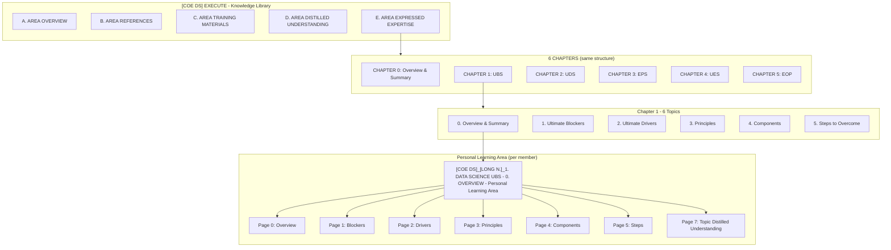

# COE Effective Learning — Full Tree Map

*One diagram to align on: Area → Chapters → Topics → Pages. Source: E. DATA SCIENCE - AREA EXPRESSED EXPERTISE, user templates, and ClickUp structure.*

**Cross-references:** Flow → `docs/ai/implementation/ile-minimal-flow.md` | Entry→Template → `docs/ai/implementation/entry-point-to-template-mapping.md` | Folder layout → `learning-book/README.md`

---

## Mermaid Diagram (One Area)



*Flow: Personal Learning Area (Pages 0–5 → Page 7 Topic Distilled Understanding) → Chapter D (per member) → Chapter E (per member) → Area D (per member) → Area E (per member).*

---

## Tree Map (One Area, e.g. Data Science)

```
[COE DS]_EXECUTE - Knowledge Library
│
├── A. [COE DS]_DATA SCIENCE - AREA OVERVIEW
├── B. [COE DS]_DATA SCIENCE - AREA REFERENCES
├── C. [COE DS]_DATA SCIENCE - AREA TRAINING MATERIALS
├── D. [COE DS]_DATA SCIENCE - AREA DISTILLED UNDERSTANDING
│   ├── [COE DS]_[MEMBER 1]_D. Personal Excellence Area Distilled Understanding
│   ├── [COE DS]_[LONG N.]_D. Personal Excellence Area Distilled Understanding
│   └── … (one per member)
└── E. [COE DS]_DATA SCIENCE - AREA EXPRESSED EXPERTISE
    ├── [COE DS]_[MEMBER 1]_E. Personal Excellence Area Expressed Expertise
    ├── [COE DS]_[LONG N.]_E. Personal Excellence Area Expressed Expertise
    └── … (one per member)
    │
    │   ═══════════════════════════════════════════════════════════════
    │   6 CHAPTERS (same structure per Chapter)
    │   ═══════════════════════════════════════════════════════════════
    │
    ├── CHAPTER 0: OVERVIEW & SUMMARY OF DATA SCIENCE
    │   ├── A. CHAPTER ROADMAP & LEVEL SPECIFICATIONS
    │   ├── B. CHAPTER REFERENCES
    │   ├── C. CHAPTER TRAINING MATERIALS
    │   ├── D. CHAPTER DISTILLED UNDERSTANDING
    │   │   ├── [COE DS]_[MEMBER]_0. DATA SCIENCE - D. Personal Chapter Distilled Understanding
    │   │   └── … (one per member)
    │   ├── E. CHAPTER EXPRESSED EXPERTISE
    │   │   ├── [COE DS]_[MEMBER]_0. DATA SCIENCE - E. Personal Chapter Expressed Expertise
    │   │   └── … (one per member)
    │   └── TOPIC 0. OVERVIEW & SUMMARY
    │       ├── 0. OVERVIEW - TOPIC TRAINING
    │       ├── 0. OVERVIEW - TOPIC EXAMPLES
    │       └── 0. OVERVIEW - TOPIC MEMBERS (Personal Learning Area)
    │           ├── [COE DS]_[LONG N.]_0. DATA SCIENCE - 0. OVERVIEW & SUMMARY - Personal Learning Area
    │           └── … (one per member)
    │
    ├── CHAPTER 1: ULTIMATE BLOCKING SYSTEM (UBS)
    │   ├── A. CHAPTER ROADMAP & LEVEL SPECIFICATIONS
    │   ├── B. CHAPTER REFERENCES
    │   ├── C. CHAPTER TRAINING MATERIALS
    │   ├── D. CHAPTER DISTILLED UNDERSTANDING
    │   │   ├── [COE DS]_[MEMBER 1]_1. DATA SCIENCE UBS - D. Personal Chapter Distilled Understanding
    │   │   ├── [COE DS]_[LONG N.]_1. DATA SCIENCE UBS - D. Personal Chapter Distilled Understanding
    │   │   └── … (one per member)
    │   ├── E. CHAPTER EXPRESSED EXPERTISE
    │   │   ├── [COE DS]_[MEMBER 1]_1. DATA SCIENCE UBS - E. Personal Chapter Expressed Expertise
    │   │   ├── [COE DS]_[LONG N.]_1. DATA SCIENCE UBS - E. Personal Chapter Expressed Expertise
    │   │   └── … (one per member)
    │   └── 6 TOPICS (each with 6 pages + Page 7 Topic Distilled Understanding)
    │       ├── TOPIC 0. OVERVIEW & SUMMARY
    │       │   └── [COE DS]_[LONG N.]_1. DATA SCIENCE UBS - 0. OVERVIEW & SUMMARY - Personal Learning Area
    │       │       └── 7 PAGES: 0–5 (Overview, Blockers, Drivers, Principles, Components, Steps) + Page 7: Topic Distilled Understanding
    │       ├── TOPIC 1. ULTIMATE BLOCKERS
    │       ├── TOPIC 2. ULTIMATE DRIVERS
    │       ├── TOPIC 3. PRINCIPLES
    │       ├── TOPIC 4. COMPONENTS
    │       └── TOPIC 5. STEPS TO OVERCOME
    │
    ├── CHAPTER 2: ULTIMATE DRIVING SYSTEM (UDS)  ← same structure as Chapter 1
    │   ├── A/B/C/D/E (Chapter level)
    │   └── 6 TOPICS (0. Overview, 1. Blockers, 2. Drivers, 3. Principles, 4. Components, 5. Steps to Utilize)
    │       └── [COE DS]_[LONG N.]_2. DATA SCIENCE UDS - 0. OVERVIEW & SUMMARY - Personal Learning Area
    │
    ├── CHAPTER 3: EFFECTIVE PRINCIPLE SYSTEM (EPS)
    ├── CHAPTER 4: ULTIMATELY EFFECTIVE SYSTEM (UES)
    └── CHAPTER 5: EFFECTIVE OPERATING PROCESS (EOP)
```

---

## Counts (One Area)

| Level | Count |
|-------|-------|
| **Area** | 1 (e.g. Data Science) |
| **Chapters** | 6 (0. Overview, 1. UBS, 2. UDS, 3. EPS, 4. UES, 5. EOP) |
| **Topics per Chapter** | 6 (0. Overview, 1. Blockers, 2. Drivers, 3. Principles, 4. Components, 5. Steps) |
| **Pages per Topic (Personal Learning Area)** | 7 pages: 0–5 (content) + Page 7 (Topic Distilled Understanding) |
| **Total Topics** | ~30 core topics (6 chapters × ~5 topics, or 6×6 depending on Chapter 0) |

---

## Naming Convention (Personal Learning Area)

```
[COE AREA]_[MEMBER NAME]_[CHAPTER ID]. [CHAPTER NAME] - [TOPIC ID]. [TOPIC NAME] - Personal Learning Area
```

**Example:** `[COE DS]_[LONG N.]_1. DATA SCIENCE UBS - 0. OVERVIEW & SUMMARY - Personal Learning Area`

| Part | Meaning |
|------|---------|
| `[COE DS]` | Group Owner (COE Area) |
| `[LONG N.]` | Owner (Member) |
| `1. DATA SCIENCE UBS` | Chapter ID + Name |
| `0. OVERVIEW & SUMMARY` | Topic ID + Name |
| `Personal Learning Area` | Folder/Item type |

---

## Canonical Questions (Headers)

*Same question set across Organise and Distilled levels. Column counts: Organise = 16 (14 questions + 2 notes); Distilled = 17 (14 questions + 3 notes). "Other Questions (Others)" appears only in Distilled Understanding and Expressed Expertise.*

### 1. What is it for? Why is it important? (Relevance)

### 2. SUCCESS
- How does it work successfully? (Success Actions)
- What ultimately causes it to work successfully? (Ultimate Drivers)
- How do the ultimate drivers cause it to work successfully? (Success Mechanism)
- What principles are the ultimate drivers based on? (Success Principles)
- What tool(s) do the ultimate drivers require to work? (Success Tools)
- What environmental conditions do the ultimate drivers require to work? (Success Environment)

### 3. FAILURE
- How can it fail? (Failure Actions)
- What ultimately causes it to fail? (Ultimate Blockers)
- How do the ultimate blockers cause it to fail? (Failure Mechanism)
- What principles are the ultimate blockers based on? (Risky Principles)
- What tool(s) do the ultimate blockers require to work? (Risky Tools)
- What environmental conditions do the ultimate blockers require to work? (Risky Environments)
- What to do if it fails? (What else?)
- **Other Questions (Others)** — *only in Distilled Understanding and Expressed Expertise*
- Next Steps to Take (Now What? Now How?)

---

## Rule: Hierarchy of Science

*When learning any Area, Chapter, or Topic, answer the canonical questions with **full respect to the Hierarchy of Science**. This enables the tree of knowledge to be mapped indefinitely and supports progression to L7 SFIA and lifelong learning.*

**Order (most complex → most fundamental):**  
Sociology → Psychology → Biology → Chemistry → Physics → Mathematics → Logic → Philosophy

**Why it flows this way:**
- Sociology is governed by Psychology (the behaviour of individuals)
- Psychology is governed by Biology (the functions of the brain)
- Biology is governed by Chemistry (the reactions of molecules)
- Chemistry is governed by Physics (the interaction of matter and energy)
- Physics is governed by Mathematics (the quantitative laws of the universe)
- Mathematics is governed by Logic (the rules of valid reasoning)
- Logic is a branch of Philosophy (the study of existence, knowledge, and ethics)

*Source: [Hierarchy of the sciences (Wikipedia)](https://en.wikipedia.org/wiki/Hierarchy_of_the_sciences)*

**Guidance for Agents and Learners:** Structure answers according to this hierarchy. Trace phenomena to their governing layer (e.g. a behavioural pattern → psychological mechanism → biological substrate → chemical process → physical law). This discipline prevents scattered learning and supports deterministic mapping of knowledge.

---

## 6 Pages per Topic (same headers, different rows)

| Page | Row label (example for UBS) | Row label (example for UDS) |
|------|-----------------------------|-----------------------------|
| 0. Overview & Summary | THE ULTIMATE BLOCKING SYSTEM | THE ULTIMATE DRIVING SYSTEM |
| 1. | ULTIMATE BLOCKER #1..#5 | ULTIMATE BLOCKER #1..#5 |
| 2. | ULTIMATE DRIVER #1..#5 | ULTIMATE DRIVER #1..#5 |
| 3. Principles | (Principles rows) | (Principles rows) |
| 4. Components | (Component rows) | (Component rows) |
| 5. Steps | (Steps rows) | (Steps rows) |
| **7. Topic Distilled Understanding** | (sub-topics 1.0–1.5) | (sub-topics 2.0–2.5) |

---

## Knowledge Flow: Capture → Organise → Distill → Express

| Phase | Where | What |
|-------|-------|------|
| **Capture** | Topic's Personal Learning Area (Pages 0–5) | Raw facts, information, sources |
| **Organise** | Topic's Personal Learning Area (Pages 0–5) | Structure into templates (questions × components) |
| **Distill** | Page 7: Topic Distilled Understanding | Condense 6 pages into sub-topics (1.0–1.5) |
| **Distill** | Chapter D: Personal Chapter Distilled Understanding | Condense 6 topics into Chapter-level understanding |
| **Express** | Chapter E: Personal Chapter Expressed Expertise | Articulate Chapter-level expertise |
| **Distill** | Area D: Personal Excellence Area Distilled Understanding | Condense 6 chapters into Area-level understanding |
| **Express** | Area E: Personal Excellence Area Expressed Expertise | Articulate Area-level expertise |

*Flow: Topic (Capture/Organise in PLA) → Page 7 (Topic Distilled) → Chapter D (Personal Chapter Distilled) → Chapter E (Personal Chapter Expressed) → Area D (Personal Area Distilled) → Area E (Personal Area Expressed).*

---

## Flow (Summary)

1. **Capture & Organise** in Topic's Personal Learning Area (Pages 0–5).
2. **Distill** into Page 7 (Topic Distilled Understanding).
3. **Distill** into Chapter D: `[COE DS]_[LONG N.]_1. DATA SCIENCE UBS - D. Personal Chapter Distilled Understanding`.
4. **Express** at Chapter E: `[COE DS]_[LONG N.]_1. DATA SCIENCE UBS - E. Personal Chapter Expressed Expertise`.
5. **Distill** into Area D: `[COE DS]_[LONG N.]_D. Personal Excellence Area Distilled Understanding`.
6. **Express** at Area E: `[COE DS]_[LONG N.]_E. Personal Excellence Area Expressed Expertise`.

---

## Content Addressing: Do We Need an "Address" or "Postal Code" per Block?

**Answer: Yes.** Each content block needs a deterministic address so the Agent and Learner know exactly where it belongs and where it will be appended.

| Level | Address form | Example |
|-------|--------------|---------|
| **Page** | Path + naming convention | `[COE DS]_[LONG N.]_1. DATA SCIENCE UBS - 0. OVERVIEW - Personal Learning Area` |
| **Row (component)** | Template row index / label | `ULTIMATE BLOCKER #1`, `CHAPTER CONTENT` |
| **Column (question)** | Header ID or index | `Relevance`, `Success Actions`, `Ultimate Drivers`, … |
| **Cell** | Row × Column | `(ULTIMATE BLOCKER #1, Success Mechanism)` |

**Why:** (1) Agent knows where to write when the user provides an answer. (2) Learner knows where to find content. (3) Sync to ClickUp is deterministic (address → location). (4) No ambiguity when resuming or switching entry points.

**Implementation options:** (1) **Implicit:** Template structure defines rows and columns; Agent infers cell from conversation context (current entry point + current question). (2) **Explicit:** Each block has a unique ID (e.g. `COE_DS.CH1.T0.P0.R1.C_SUCCESS_MECH`). Explicit IDs enable programmatic mapping and validation; implicit is simpler for Iteration 1–2. Recommend: start implicit, add explicit IDs if sync or validation requires it.
