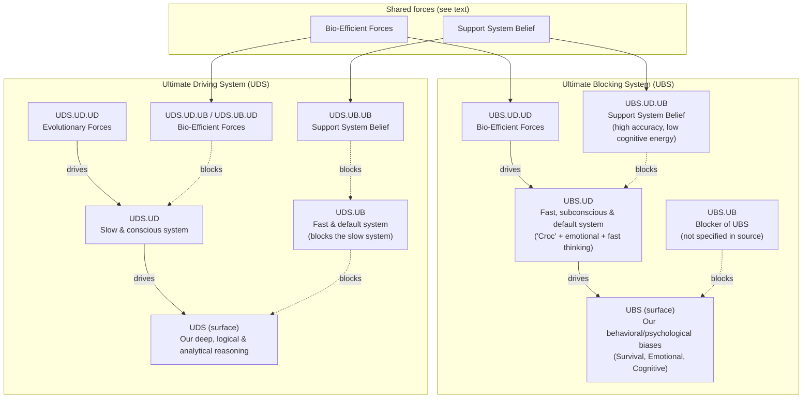

# LTC Advanced Effective Learning System

This document converts the full Effective Learning System from the LTC COE EFF source into a single markdown reference. It preserves the **contents and chain of logic**: from the phenomenon and problem, through the Ultimate Blocking System (UBS) and Ultimate Driving System (UDS), to the Strategic Effective Learning System Design and the User Guide (EPS → UES → EOP).

---

## 1. High-Level Frame: Phenomenon → Problem → Risks → Solution

| Dimension               | Content                                                                                        |
| ----------------------- | ---------------------------------------------------------------------------------------------- |
| **The Phenomenon**      | More fundamental & more deductive                                                              |
| **The Problem**         | Simpler & fewer possibilities                                                                  |
| **Risks / Uncertainty** | Decrease                                                                                       |
| **Solution Feature**    | More complete, more effective, more valuable, likely simpler & likely requiring less resources |

*Chain of logic:* Understanding the phenomenon in a more fundamental, deductive way reduces the apparent problem space (simpler, fewer possibilities), which decreases risks/uncertainty. The solution that emerges is more complete, effective, valuable, and often simpler and less resource-intensive.

---

## 2. User, User's Action, and User's Desired Outcome

Before mapping what blocks or drives learning, we anchor on **who** is acting and **toward what**.

| Term                             | Definition                                                                                                                                                                                                                                            |
| -------------------------------- | ----------------------------------------------------------------------------------------------------------------------------------------------------------------------------------------------------------------------------------------------------- |
| **User**                         | The **Learner** — the person who is trying to learn effectively (e.g. a student, professional, or self-directed learner).                                                                                                                             |
| **User's Action**                | The **actions the learner takes** to move toward the desired outcome: e.g. studying, practicing, reflecting, applying, and engaging in learning activities that build understanding and wisdom.                                                       |
| **User's Desired Outcome (UDO)** | **Optimal acquisition of wisdom for the learner's given resources.** The learner aims to get the highest-quality learning (wisdom) possible within their constraints (time, energy, context). This is "Effective Learning" as defined in this system. |

The rest of the document maps **what blocks** this (UBS) and **what drives** it (UDS), so we can design principles, environment, tools, and actions that deactivate blockers and activate drivers.

---

## 3. Causal Diagram: UBS and UDS (Full Causal Relationship)

The diagram below shows how deeper forces **drive** or **block** the surface systems. Arrows mean “strengthens” or “drives”; block arrows mean “weakens” or “blocks.” **Shared forces** (Bio-Efficient Forces, Support System Belief) appear once; their **different roles** on the UBS side vs the UDS side are noted in the following section.

**How to read:** Solid arrows = “drives/strengthens”; dashed = “blocks/weakens.” So: **UBS.UD.UD** (bio-efficient) drives **UBS.UD** (fast system), which drives **UBS** (biases). **UBS.UD.UB** (support belief) blocks **UBS.UD**, so it weakens UBS. On the UDS side, **UDS.UD.UD** (evolutionary) drives **UDS.UD** (slow system), which drives **UDS** (reasoning). **UDS.UD.UB** (bio-efficient) blocks **UDS.UD**; **UDS.UB.UB** (support belief) blocks **UDS.UB**, so the slow system can prevail.

---

## 4. Shared Cross-System Forces (One Concept, Two Roles)

Two forces appear in **both** UBS and UDS. They are the **same** force; only their **role** (driver vs blocker) and **target** (UBS vs UDS) differ. Understanding this avoids duplication and clarifies design.

### 4.1 Bio-Efficient Forces

**What it is:** The natural tendency to conserve energy and operate on “good enough” efficiency and autopilot (default mode). It favors low cognitive load and quick, satisfactory answers.

| In UBS | In UDS |
|--------|--------|
| **Role:** Ultimate **Driver** of the blocker. | **Role:** Ultimate **Blocker** of the driver. |
| **Label:** UBS.UD.UD. | **Label:** UDS.UD.UB (and UDS.UB.UD). |
| **Effect:** Drives the fast system (UBS.UD), which in turn drives UBS. So bio-efficiency **strengthens** our biases and "good enough" behavior → **more blocking** of effective learning. | **Effect:** Blocks the slow system (UDS.UD). So bio-efficiency **weakens** deliberate, effortful reasoning → **less driving** of effective learning. |
| **Design implication:** Reduce or work around conditions where bio-efficiency is dominant (e.g. tired, under pressure, familiar routine) so UBS is less active. | **Design implication:** Same: reduce low-energy, high-pressure, autopilot conditions so UDS.UD can engage and UDS can dominate. |

**Takeaway:** One force (bio-efficiency) **helps the blocker (UBS)** and **hurts the driver (UDS)**. Design for safety, energy, and cognitive offloading so this force does not dominate.

### 4.2 Support System Belief (High Accuracy, Low Cognitive Energy)

**What it is:** Strong belief in a support system that can help us achieve **high cognitive accuracy** while requiring **low cognitive energy** (e.g. templates, AI buddy, structured process).

| In UBS | In UDS |
|--------|--------|
| **Role:** Ultimate **Blocker** of the driver of UBS. | **Role:** Ultimate **Blocker** of the blocker of UDS. |
| **Label:** UBS.UD.UB. | **Label:** UDS.UB.UB. |
| **Effect:** **Blocks** UBS.UD (the fast system that drives UBS). So this belief **weakens** UBS → **less blocking** of effective learning. | **Effect:** **Blocks** UDS.UB (the fast system that blocks UDS). So this belief **weakens** what blocks UDS → **more driving** of effective learning. |
| **Design implication:** Provide a support system (environment, tools, process) that feels safe, low-effort, and accuracy-oriented so the fast system is less needed to “protect” the learner. | **Design implication:** Same support system lets the slow system engage without being shut down by the fast system; reasoning and accuracy can dominate. |

**Takeaway:** One belief (support system) **weakens the blocker (UBS)** and **strengthens the driver (UDS)**. Design for blameless, low-pressure, accuracy-assured support (templates, AI, CODE, etc.) so both effects apply.

---

## 5. Ultimate Blocking System (UBS) — Top Down

UBS is the **conscious system of forces that stop the learner** from reaching the desired outcome. We describe it **from the surface (UBS) down**: first the full system at the level of “our biases,” then what drives it (UBS.UD), then the deepest driver (UBS.UD.UD) and the force that blocks that driver (UBS.UD.UB).

### 5.1 UBS (Surface) — Full System

**What it is:** Our behavioral/psychological biases: (1) Survival, (2) Emotional, (3) Cognitive. This is the visible “blocking” behavior.

**UBS Principles**

1. Safety first, feeling good second, and then "reasonable enough" sensemaking.
2. Making "sensible" stories rather than logical reasoning.
3. Emotional reasoning — If I feel good about it, it is good.
4. WYSIATI — "What you see is all there is".

**UBS Ideal Environment**

1. Perceivedly unsafe: physically, emotionally or mentally.
2. High cognitive loads: distracted, multitasking, too much going on.
3. Under pressure: time, stress, or emotional imbalance.
4. Low energy: tired, hungry, or mentally exhausted.

**UBS Tools**

1. Unconditional reactions to keep you alive.
2. Heuristics using associations: (i) Affect heuristics (I like it → it is good), (ii) Representative heuristics or stereotypes (it looks good → it is good), (iii) Availability heuristics (it's been good recently → it is good).
3. Emotional "tagging" & biochemistry hormone reward system → we justify our biases even more.

**UBS Actions**

1. Misattributing the root cause.
2. Overvalue irrelevant information: (i) anchor (first), (ii) availability (recent or vivid).
3. Undervalue relevant information & seek confirming evidence.
4. Make sense rather than reason.
5. Create stories rather than logics.
6. False beliefs in these self-created stories.

---

### 5.2 What Drives UBS: UBS.UD (Fast System)

**What it is:** The fast, subconscious & default system of our brains (including "croc" brains, emotional brains, and fast thinking). It **drives** UBS: when this system is in charge, biases dominate. There is **no natural blocker** of our psychological biases unless we introduce one (e.g. support system belief — see UBS.UD.UB).

**UBS.UD Principles**

1. Safety first, feeling good second, and finally accurate understanding.
2. "Reasonable enough" sensemaking.
3. Speed over accuracy.
4. WYSIATI — "What you see is all there is".
5. Association over logic (as related neurons are associated).
6. Heuristic (trial and error): (i) Prefer to acquire personal experience, (ii) Prefer to view the world via personal experience, (iii) Prefer to solve problems via personal experience.

**UBS.UD Ideal Environment**

1. Perceived unsafe: physically, emotionally or mentally.
2. High cognitive loads: distracted, multitasking, too much going on.
3. Under pressure: time, stress, or emotional imbalance.
4. Low energy: tired, hungry, or mentally exhausted.
5. Familiar routine (e.g. driving or walking).

**UBS.UD Tools**

1. Unconditional reactions for survival.
2. The natural & unconscious emotional needs to feel good (e.g. to be important, to be loved, and to love).
3. The "good hormones" system that rewards good feelings.
4. Associative Memory: load & store associations of the information received.
5. Heuristics (mental shortcuts/simplified rules): making simplified connections rather than logical reasoning.

**UBS.UD Actions**

- Automatic & efficient finding of quick & "good enough" solutions.

---

### 5.3 What Drives UBS.UD: UBS.UD.UD (Bio-Efficient Forces)

**What it is:** The **deepest driver** of UBS: the bio-efficient forces that favor "good enough" efficiency and autopilot. (This is the **same** force as in §4.1; here we see its full system description in the UBS chain.)

**UBS.UD.UD Principles**

1. "Good enough" efficiency.
2. "Auto pilot" automaticity: default mode.

**UBS.UD.UD Ideal Environment**

1. Energy saving is critical (tired or hungry).
2. Under pressure: time, stress, or emotional imbalance.
3. Familiar routine (e.g. driving or walking).

**UBS.UD.UD Tools**

1. The natural & unconscious need to conserve energy.

**UBS.UD.UD Actions**

- Reduce cognitive loads & save energy.

---

### 5.4 What Blocks UBS.UD: UBS.UD.UB (Support System Belief)

**What it is:** The **blocker of the driver of UBS**: strong belief in a support system that can help us achieve high cognitive accuracy yet requires low cognitive energy. When present, it **weakens** UBS.UD (the fast system), so UBS is less dominant. (Same force as in §4.2; here is its full system in the UBS chain.)

**UBS.UD.UB Principles**

1. Physically & mentally safe to do.
2. Fun or feel good to do.
3. Not draining on cognitive energy: guided process that is natural to our fast system.
4. Cognitive offloading: the system does the complex thinking part.
5. Accuracy assured: our brain can receive high-quality information & focus on the solution.

**UBS.UD.UB Ideal Environment**

1. Blameless. Default to curiosity & improvement and not punishment.
2. All relevant ideas are appreciated & considered.
3. No pressure.

**UBS.UD.UB Tools**

1. Energy management system.
2. External cognitive aids (AI, automations, etc.).
3. Information collection, information processing & decision-making tools.

**UBS.UD.UB Actions**

- Assure us that the brain can think well with minimal energy requirement with a good support system.

---

### 5.5 UBS.UB (Blocker of UBS)

**UBS.UB:** Principles, Ideal Environment, Tools, Actions — *not detailed in source (empty / N/A in diagram).* The conceptual role is “what would block UBS from affecting the user”; in practice we focus on deactivating UBS by weakening UBS.UD via UBS.UD.UB (support system) and by managing environment so UBS.UD.UD (bio-efficiency) does not dominate.

---

## 6. Ultimate Driving System (UDS) — Top Down

UDS is the **conscious system of forces that push the learner** toward the desired outcome: our deep, logical & analytical reasoning. We describe it **from the surface (UDS) down**: first the full system at the level of “our reasoning,” then what drives it (UDS.UD) and what blocks it (UDS.UB), then the deepest driver (UDS.UD.UD), the blocker of that driver (UDS.UD.UB / Bio-Efficient), and the blocker of the blocker (UDS.UB.UB / Support System Belief).

### 6.1 UDS (Surface) — Full System

**What it is:** Our deep, logical & analytical reasoning — the visible “driving” behavior we want to maximize.

**UDS Principles**

1. Truth finding over sense making.
2. Skepticism (is it really right?) over Acceptance (it feels/looks/sounds right).
3. Growth over good feeling.
4. Completeness over WYSIATI.
5. EFFORTFUL: it requires a conscious choice and allocation of mental energy.

**UDS Ideal Environment**

1. Low cognitive loads: little distraction and no multitasking.
2. High cognitive resources: ample time, well-rested, well-fed, emotionally stable.
3. Psychological safety — wrong ideas are not punished & relevant ideas are appreciated.
4. Self-disassociation & teamwork — it's easier to spot others' cognitive errors than our own.

**UDS Tools**

1. Working Memory with actual received information instead of Associated Memory.
2. Logical reasoning.
3. Hypothetical analysis.
4. Cognitive Control — asking ourselves & checking our automatic solutions & snap judgements.

**UDS Actions**

1. Self-correction.
2. Finding the best solutions rather than getting rid of problems.
3. Critical evaluation.
4. Logical reasoning.
5. Hypothetical analysis.
6. Strategic planning.

---

### 6.2 What Drives UDS: UDS.UD (Slow, Conscious System)

**What it is:** The slow & conscious system of our brain. It **drives** UDS: when this system is engaged, deep reasoning dominates.

**UDS.UD Principles**

1. Think in sequential steps and not intuitive leaps.
2. Accuracy is critical, not speed. It seeks supporting evidence.
3. "Laziness" — will not engage unless it absolutely must.
4. "Deliberate pilot" control — conscious & effortful. We must choose to engage it.

**UDS.UD Environment**

1. Low cognitive loads. System II can't multitask.
2. High cognitive resources (ample time, well rested, well-fed, not emotionally overwhelmed).
3. Psychological safety.

**UDS.UD Tools**

1. Working Memory with actual received information instead of Associated Memory.
2. Logical reasoning.
3. Hypothetical analysis.
4. Cognitive Control — asking ourselves & checking our automatic solutions & snap judgements.

**UDS.UD Actions**

- Override impulse & deliver highest cognitive quality possible.

---

### 6.3 What Blocks UDS: UDS.UB (Fast System as Blocker)

**What it is:** The fast & default system of our brain (same machinery as UBS.UD). It **blocks** UDS: when the fast system takes over, the slow system disengages and UDS weakens. So UDS.UB is the “blocker of the driver” at the UDS surface. There is no separate full system description here; the fast system is described under UBS.UD. To strengthen UDS, we weaken UDS.UB — e.g. via UDS.UB.UB (support system belief).

---

### 6.4 What Drives UDS.UD: UDS.UD.UD (Evolutionary Forces)

**What it is:** The **deepest driver** of UDS: evolutionary forces that favor conflict detection, cost-benefit analysis, and goal maintenance — i.e. “is this good enough?” and “is it worth thinking harder?”

**UDS.UD.UD Principles**

1. Conflict detection: detect System 1's error. "Is it not good enough anymore?"
2. Cost-benefit analysis: "Is the cost of being wrong larger than the cost of thinking harder?"
3. Goal maintenance: ("I'm on a diet").

**UDS.UD.UD Environment**

1. High stakes.
2. New solution required.
3. Negative feedback: pain of failure calls for higher need of accuracy.

**UDS.UD.UD Tools**

1. Conscious interruption ("Mental Break"): "Hold on a minute!" — way to get out of the autopilot mode.
2. Need for betterment.

**UDS.UD.UD Actions**

- Constant drive for improvement.

---

### 6.5 What Blocks UDS.UD: UDS.UD.UB (Bio-Efficient Forces)

**What it is:** The **blocker of the driver of UDS**: the same **bio-efficient forces** as UBS.UD.UD (§4.1). Here they **block** the slow system (UDS.UD), so UDS is less dominant.

**UDS.UD.UB Principles**

1. "Good enough" efficiency.
2. "Auto pilot" automaticity: default mode.

**UDS.UD.UB Ideal Environment**

1. Energy saving is critical (tired or hungry).
2. Under pressure: time, stress, or emotional imbalance.
3. Familiar routine (e.g. driving or walking).

**UDS.UD.UB Tools**

1. The natural & unconscious need to conserve energy.

**UDS.UD.UB Actions**

- Reduce cognitive loads & save energy.

*Note:* UDS.UB.UD is the same force in the “blocker of UDS” chain (what drives the fast system that blocks UDS). Same Principles, Environment, Tools, Actions as UDS.UD.UB.

---

### 6.6 What Blocks UDS.UB: UDS.UB.UB (Support System Belief)

**What it is:** The **blocker of the blocker of UDS**: strong belief in a support system that can help us achieve high cognitive accuracy with low cognitive energy. When present, it **weakens** UDS.UB (the fast system), so UDS.UD can engage and UDS dominates. (Same force as §4.2 and UBS.UD.UB.)

**UDS.UB.UB Principles**

1. Physically & mentally safe to do.
2. Fun or feel good to do.
3. Not draining on cognitive energy: guided process that is natural to our fast system.
4. Cognitive offloading: the system does the complex thinking part.
5. Accuracy assured: our brain can receive high-quality information & focus on the solution.

**UDS.UB.UB Ideal Environment**

1. Blameless. Default to curiosity & improvement and not punishment.
2. All relevant ideas are appreciated & considered.
3. No pressure.

**UDS.UB.UB Tools**

1. Energy management system.
2. External cognitive aids (AI, automations, etc.).
3. Information collection, information processing & decision-making tools.

**UDS.UB.UB Actions**

- Assure us that the brain can think well with minimal energy requirement with a good support system.

---

## 7. Strategic Effective Learning System Design

**Goal:** To best overcome the UBS and best utilize the UDS so that learning is **effective** — optimal acquisition of wisdom for a learner's given resources.

### 7.1 Effective Learner

*(Concept: the learner as the agent who operates within this system; implied by "Effective Learning" and the design below.)*

### 7.2 Effective Learning

**Definition:** Optimal acquisition of wisdom for a learner's given resources.

### 7.3 Three Pillars and Risk Management

The design is built from three pillars, each with **Risk Management** (deactivate UBS & UDS blockers), **Sustainability** (DOs and DON'Ts), **Efficiency** (highest output at current resources), **Scalability** (highest increase in output per additional resources), and **Driving Maximum Output** (activate UDS drivers & maximize UDS).

---

#### 1. Effective Learning Principle (EPS)

**Purpose:** To deactivate the UBS and maximize the effects of the UDS.

EPS principles are organized into two sub-categories, each with three dimensions:

| | **A. Risk Management (De-risking)** | **B. Driving Maximum Output** |
|---|---|---|
| **Goal** | Deactivate UBS & UDS blockers | Activate UDS drivers & maximize UDS |
| **Sustainability** | Minimize failure risks | Minimize failure risks to driving output |
| **Efficiency** | Highest de-risking output at current resources | Highest value-creation output at current resources |
| **Scalability** | Highest increase in de-risking per additional resource | Highest increase in value-creation per additional resource |

---

##### A. Risk Management Principles (Deactivate UBS & UDS Blockers)

**A.1 Sustainability — Minimize Failure Risks**

*DOs (conditions that weaken UBS and remove UDS blockers):*

- Physically, mentally & emotionally safe.
- Fun & feel good to do (satisfy emotional needs without triggering bias).
- Low cognitive loads (reduce activation conditions for the fast system).
- Cognitive offloading via automations, templates, AI (reduce dependence on biased heuristics).
- Accuracy assured by the support system (remove the need for "good enough" shortcuts).

*DON'Ts (patterns that strengthen UBS or feed UDS blockers):*

- "Good enough" efficiency & "reasonable enough" philosophy.
- "Autopilot" automaticity (defaulting to System 1 without check).
- Over-reliance on personal experience as the sole lens (anchoring, availability bias).
- Speed over accuracy.
- Constructing "sensible stories" instead of logical reasoning.
- Emotional reasoning (if it feels right → it is right).
- WYSIATI — "What you see is all there is."

**A.2 Efficiency — Highest De-risking Output at Current Resources**

- **Target UBS.UD.UD (Bio-Efficient Forces) first:** Before studying, eliminate environmental triggers that activate energy-conservation instincts—remove distractions, set a clear start/end time, and pre-decide the learning scope so the brain does not default to "this is too costly, skip it."
- **Weaken UBS.UD (Fast System) before engaging content:** Begin each learning session with a 2-minute "slow-down ritual" (e.g., write down what you already believe about the topic) to surface System 1 assumptions before they silently distort new information.
- **Pareto-target the dominant biases in learning:** Focus de-risking effort on the three biases that cause most learning errors: (1) WYSIATI—assuming what you see is all there is; (2) Anchoring—over-weighting the first piece of information; (3) Confirmation bias—seeking evidence that supports existing beliefs. Use a pre-learning checklist: "What am I assuming? What might I be missing? What would contradict my current view?"
- **Batch high-bias decisions into high-energy windows:** Schedule complex or novel learning (where bias risk is highest) for times when the slow system is naturally available—typically morning or after rest—not when fatigued or under time pressure.
- **Single-task to prevent fast-system hijacking:** Close all unrelated tabs, silence notifications, and commit to one learning entry point at a time. Multitasking activates the fast system's "good enough" mode and increases error rates.
- **Offload bias-checking to external structures:** Use templates (e.g., the Organise Information table with UBS/UDS/EPS columns) so that bias-checking is embedded in the workflow, not dependent on willpower or memory.

**A.3 Scalability — Highest Increase in De-risking per Additional Resource**

- **Systematize bias detection into reusable question sets:** Create a standard "bias audit" checklist (e.g., "Did I consider disconfirming evidence? Did I anchor on the first source? Did I assume completeness?") that applies to every new subject. Each new learning domain reuses the same de-risking framework at near-zero marginal cost.
- **Automate repetitive de-risking with AI-assisted review:** Configure the Agent to flag common bias patterns (e.g., missing counterarguments, over-reliance on a single source) during the learning conversation. The cost of each additional check decreases as the automation improves.
- **Build transferable mental models of UBS patterns:** Learn the causal structure of the UBS (bio-efficiency → fast system → surface biases) once, then apply it to diagnose learning errors in any domain. One model de-risks many subjects.
- **Create compounding meta-cognitive feedback loops:** After each learning session, log one bias you caught and how you caught it. Over time, this "bias journal" trains your detection sensitivity—each correction improves future accuracy, compounding the return on de-risking effort.
- **Leverage the Support System (UBS.UD.UB) to block the fast system:** Design your learning environment so that accuracy is assured by external structures (templates, AI, peer review) rather than personal vigilance. When the support system is trusted, the brain's "good enough" shortcut loses its appeal.

---

##### B. Driving Maximum Output Principles (Activate UDS Drivers & Maximize UDS)

**B.1 Sustainability — Minimize Failure Risks to Driving Output**

*DOs (conditions that keep UDS engaged and prevent it from disengaging):*

- Detection of biases (meta-cognition): continuously monitor whether System 1 has injected errors.
- Cost-benefit analysis before engaging the slow system: "Is the cost of being wrong larger than the cost of thinking harder?"
- Deliberate choice to think critically (conscious activation of System 2).
- Growth over good feeling: prioritize learning accuracy over emotional comfort.
- Completeness & truth finding over WYSIATI.
- Skepticism (is it really right?) over acceptance (it feels/looks/sounds right).

**B.2 Efficiency — Highest Value-Creation Output at Current Resources**

- Focus slow-system energy on highest-leverage questions (Pareto): allocate deliberate reasoning to novel, high-stakes, or high-uncertainty problems; automate or template the rest.
- Use structured reasoning frameworks (Working Memory + templates, CODE) to reduce cognitive waste and channel effort into productive analysis.
- Decompose complex problems into sequential steps; leverage System 2's strength (step-by-step logic) rather than forcing it to hold everything at once.
- Apply evidence-based reasoning: demand supporting evidence for each claim to maximize accuracy per unit of mental effort.
- Minimize context-switching: protect focused reasoning blocks so the slow system stays engaged longer per session.

**B.3 Scalability — Highest Increase in Value-Creation per Additional Resource**

- Build reusable reasoning frameworks and schemas that compound across learning sessions; each new session benefits from all prior frameworks.
- Convert validated insights into long-term memory structures (schemas, mental models) that reduce future cognitive cost for the same class of problem.
- Create iterative feedback loops (review → test → apply → reflect) where each cycle increases accuracy and reduces the effort required for the next.
- Leverage collaborative reasoning (COE structure, teamwork, self-disassociation): each additional perspective multiplies error-detection capacity and expands the solution space.
- Encode reasoning patterns into templates so that marginal effort per new topic decreases as the template library grows.

---

#### 2.a. Effective Learning Environment

**Purpose:** To best deliver the Effective Principle System in order to best overcome the UBS & best utilize the UDS.

Environment design follows the same two-sub-category structure as EPS. Risk Management environments are detailed below; Driving Maximum Output environments follow.

---

##### A. Risk Management Environments (Deactivate UBS & UDS Blockers)

**A.1 Sustainability — Minimize Failure Risks**

*DOs:*

| Physical | Digital | Cultural |
|----------|---------|----------|
| Physically safe space (well-lit, comfortable, ergonomic). | Low-load interfaces: minimal notifications, single-task mode. | Psychologically safe: blameless, curiosity-first, no punishment for wrong ideas. |
| High energy state: well-rested, well-fed, not physically drained. | Cognitive offloading via automations and templates (reduce manual, bias-prone processing). | All relevant ideas are welcomed and considered. |
| Low sensory distractions: quiet, uncluttered. | | No time pressure; encourage accuracy over speed. |
| | | Fun and feel-good tone in interactions. |

*DON'Ts:*

| Physical | Digital | Cultural |
|----------|---------|----------|
| Physically unsafe or uncomfortable conditions. | High cognitive loads: multiple apps, constant notifications, multitasking interfaces. | Pressurizing deadlines or competitive framing. |
| Low energy states (fatigued, hungry, sleep-deprived). | Familiar/repetitive digital patterns that trigger autopilot without check. | Punitive response to errors. |
| | | Familiar-topic complacency (triggers "good enough" mode). |

**A.2 Efficiency — Highest De-risking Output at Current Resources**

| Physical | Digital | Cultural |
|----------|---------|----------|
| Align sessions with circadian energy peaks (learn during natural high-alertness windows to maximize slow-system availability). | Single-app / single-tab mode; block all unrelated notifications during sessions. | Default to structured protocols (e.g. COE question-answer format) to channel existing group energy into bias detection. |
| Single-purpose space dedicated to learning (avoid context-bleed from non-learning activities). | Pre-configured workspace templates that auto-load correct context per session (zero setup friction). | Normalize short, focused sessions over marathon sessions (protect per-session cognitive quality before fatigue sets in). |
| Keep essential materials within arm's reach to avoid break-in-flow retrieval. | Time-boxed session timers to prevent cognitive fatigue past the point of diminishing returns. | Immediate, specific feedback culture: catch biases in real time rather than in retrospective reviews. |

**A.3 Scalability — Highest Increase in De-risking per Additional Resource**

| Physical | Digital | Cultural |
|----------|---------|----------|
| Modular, replicable station setup (documented checklist: lighting, noise, ergonomics) so any new space becomes learning-ready in minutes. | Shareable workspace configurations (environment-as-code) so new devices or team members inherit the same distraction-free, offloading-enabled setup instantly. | Documented learning-culture norms (blameless, accuracy-first, no pressure) that onboard new participants without re-teaching values. |
| Portable environmental standards that travel with the learner (e.g. noise-cancelling headphones, consistent desk kit). | Platform-agnostic templates and automations transferable across tools (not locked to one vendor). | Peer review structures (COE pairs, review buddies) where each additional member non-linearly increases bias-detection coverage. |
| | Centralized distraction policy that scales across all devices and apps with one rule set. | Shared vocabulary for bias types so the cost of identifying and communicating biases decreases as the group grows. |

---

##### B. Driving Maximum Output Environments (Activate UDS Drivers & Maximize UDS)

**B.1 Sustainability — Minimize Failure Risks to Driving Output**

*DOs (conditions that keep UDS engaged and prevent it from disengaging):*

| Physical | Digital | Cultural |
|----------|---------|----------|
| High cognitive resources: ample time, well-rested, well-fed, emotionally stable (space and schedule that support sustained slow-system engagement). | Low cognitive loads in the interface: single-focus mode, no competing notifications (so the slow system is not hijacked). | Psychological safety: wrong ideas are not punished; relevant ideas are appreciated. |
| Comfortable, ergonomic space that supports long reasoning blocks without physical distraction. | Tools that encourage accuracy over speed (e.g. evidence fields, checklists, review prompts). | Require new & important solutions (novelty activates UDS.UD.UD conflict detection and goal maintenance). |
| | | Self-disassociation & teamwork → COE structure (leverage collaborative reasoning to multiply error-detection). |
| | | Norms that favor skepticism, completeness, and truth finding over acceptance and WYSIATI. |

*DON'Ts (conditions that weaken UDS or trigger the fast system):*

| Physical | Digital | Cultural |
|----------|---------|----------|
| Low energy or time-pressured conditions (triggers bio-efficiency and autopilot). | Multitasking interfaces or familiar, repetitive flows that invite autopilot without check. | Pressurizing or punitive framing (drives learner into fast-system defensiveness). |
| Interruptible or shared space where focus is frequently broken. | Speed-optimized workflows that skip evidence or review steps. | Familiar-topic complacency (no conflict detection, so slow system does not engage). |

**B.2 Efficiency — Highest Value-Creation Output at Current Resources**

| Physical | Digital | Cultural |
|----------|---------|----------|
| Dedicated focus space for reasoning blocks (no context-bleed from non-learning tasks). | Single-focus workspace: one task, one context, no tab/app switching during reasoning. | Structured protocols for high-leverage questions first (Pareto): allocate group time to novel, high-stakes, or high-uncertainty problems. |
| Materials and references organized for sequential access (reduce working-memory load). | Pre-configured reasoning templates (e.g. CODE, step-by-step frameworks) that reduce setup and channel effort into analysis. | Norms for step-by-step reasoning and evidence-based claims (maximize accuracy per unit of mental effort). |
| Protected time blocks (e.g. focus hours) so the slow system stays engaged longer per session. | Time-boxed reasoning sessions with built-in review checkpoints to prevent fatigue past diminishing returns. | Immediate, specific feedback on reasoning quality (catch gaps in real time rather than in retrospect). |

**B.3 Scalability — Highest Increase in Value-Creation per Additional Resource**

| Physical | Digital | Cultural |
|----------|---------|----------|
| Replicable focus stations (documented setup: lighting, ergonomics, materials) so any new space supports reasoning in minutes. | Shareable reasoning templates and workspace configs (CODE, frameworks) so new devices or team members inherit the same high-focus, evidence-enabled setup. | Documented COE and teamwork norms (psychological safety, novelty, skepticism) that onboard new participants without re-teaching values. |
| Portable focus kit (e.g. noise-cancelling, consistent materials) that travels with the learner. | Platform-agnostic templates and frameworks transferable across tools (not locked to one vendor). | Peer review and COE structures (pairs, buddies) where each additional member non-linearly increases reasoning quality and error-detection coverage. |
| | Centralized knowledge base and feedback loops (review → test → apply → reflect) that compound across sessions. | Shared vocabulary for reasoning types and evidence standards so the cost of communicating and improving reasoning decreases as the group grows. |

---

#### 2.b. Effective Learning Tools

**Purpose:** To best deliver the Effective Principle System in order to best overcome the UBS & best utilize the UDS. Tools are chosen to fit the ideal **Environments** in §2.a (Physical / Digital / Cultural). The **ILE (Integrated Learning Environment)** — this project — is the Digital Tool being built to embody this system (Learning Book, A. Subject Roadmap, templates, entry points, session log, persistent memory) inside a single workspace (e.g. Cursor).

---

##### A. Risk Management Tools (Deactivate UBS & UDS Blockers)

**A.1 Sustainability — Minimize Failure Risks**

*DOs (tools that weaken UBS and remove UDS blockers):*

| Physical | Digital | Cultural |
|----------|---------|----------|
| Energy management: sleep/activity trackers (e.g. Oura, Whoop) to align sessions with high-energy windows; hydration/meal reminders. | **ILE:** A. Subject Roadmap + Learning Book as single source of truth; templates offload structure so the learner doesn’t rely on memory. **Cursor:** one workspace (chat + Markdown), rules, optional memory so context is scoped, not scattered. | Shared norms doc or wiki (e.g. Notion, Confluence) that states blameless, accuracy-first, no-pressure principles so everyone can reference the same “contract.” |
| Noise-cancelling headphones (e.g. Sony WH-1000XM5, Bose QuietComfort) to enforce low sensory load in any space. | **AntiGravity** or **Cursor Chat:** low-notification, single-conversation focus; no competing tabs for the learning dialogue. | **COE structure** (e.g. in ClickUp or ILE): Topic / Sub-topic / Question hierarchy so bias detection is built into the workflow, not ad hoc. |
| Mental breaks: Pomodoro or focus timers (e.g. Be Focused, Focus@Will) to force pauses and exit autopilot. | Pre-configured **focus mode** (e.g. macOS Focus, Freedom, Cold Turkey) to block unrelated apps/notifications during learning sessions. | **Bias checklist** (physical or digital card): “What am I assuming? What might I be missing? What would contradict this?” — used at session start or before key decisions. |

*DON'Ts (tools or patterns that strengthen UBS):*

| Physical | Digital | Cultural |
|----------|---------|----------|
| Relying only on “when I feel like it” with no external cue for energy or breaks (triggers autopilot and low energy). | Using **only** associative, chronological feeds (e.g. raw chat scroll, unsorted notes) as primary memory — prefer Working Memory backed by structure (ILE: A + Learning Book, templates). | Using tools that optimize for speed or volume (e.g. “answer in 30 seconds”) without evidence or review steps. |

**A.2 Efficiency — Highest De-risking Output at Current Resources**

| Physical | Digital | Cultural |
|----------|---------|----------|
| **One** dedicated desk/station checklist (lighting, noise, ergonomics, materials) so setup is repeatable in minutes; e.g. laminated card or Notion page. | **ILE:** Entry point → template mapping; one entry point at a time, pre-loaded template and A context — zero setup friction per session. **Cursor:** single workspace, no app switching. | **COE question-answer protocol** (e.g. in ILE templates): structured Q&A (Topic, Sub-topic, Question) so bias detection is the default, not an extra step. |
| Single Pomodoro or time-box timer (e.g. 25 min focus + 5 min break) to protect session length and prevent fatigue past diminishing returns. | **Pre-configured workspace** (e.g. Cursor workspace + ILE repo): one clone, open, choose subject/entry point — same “environment” every time. | **Short-session norm:** e.g. “We do 2–3 focused blocks, then stop” — reinforced by shared calendar or ClickUp time tracking. |
| Essential materials checklist (e.g. “water, notebook, one textbook”) so nothing triggers break-in-flow retrieval. | **Bias-check prompts** inside templates (e.g. ILE Organise/Distill tables with UBS/UDS/EPS columns) so checking is in-flow, not retrospective. | **Real-time feedback** habit: e.g. “Before we move on, what could be wrong with this?” — supported by COE buddy or peer review in ClickUp/ILE. |

**A.3 Scalability — Highest Increase in De-risking per Additional Resource**

| Physical | Digital | Cultural |
|----------|---------|----------|
| **Replicable station checklist** (one doc or card): lighting, noise, ergonomics — duplicate for new room or new learner so any space is learning-ready in minutes. | **ILE repo + A template:** clone once; new subject = new A (Roadmap) + Learning Book branch. Same entry-point→template logic everywhere. **Cursor rules / dotfiles:** shareable so new devices get the same focus and scoping. | **Documented learning-culture norms** (e.g. in README or wiki): blameless, accuracy-first, no pressure — onboard new participants without re-teaching. |
| **Portable kit** (noise-cancelling headphones, same notebook brand, same pen) so environment travels with the learner. | **Platform-agnostic templates:** Markdown + standard structure (e.g. ILE `templates/`) so they work in Cursor, Obsidian, or any editor; not locked to one vendor. | **Peer review / COE pairs:** e.g. “buddy” field in ClickUp or ILE; each new member adds bias-detection coverage. |
| | **Centralized focus policy:** one blocklist or Focus mode config (e.g. Freedom, macOS) that scales to all devices. | **Shared vocabulary for bias types** (e.g. WYSIATI, anchoring, confirmation bias) in a short glossary so the cost of communicating “what went wrong” drops as the group grows. |

---

##### B. Driving Maximum Output Tools (Activate UDS Drivers & Maximize UDS)

**B.1 Sustainability — Minimize Failure Risks to Driving Output**

*DOs (tools that keep UDS engaged):*

| Physical | Digital | Cultural |
|----------|---------|----------|
| Same energy and focus tools as A.1 (trackers, headphones, Pomodoro) so the slow system has the resources to stay on. | **ILE:** A (Roadmap) + Session Log + Level Completion Checklist so the Agent (and learner) always know “where I am” and “what’s next” — no context collapse, so the slow system doesn’t disengage. **Cursor:** rules + optional memory so principles and conventions persist across chats. | **Psychological safety in the tool:** e.g. ILE/ClickUp “progress” and “evidence” fields that reward iteration and evidence, not one-shot right answers. |
| Comfortable, ergonomic setup (chair, desk height, screen) so long reasoning blocks don’t get cut short by physical distraction. | **Evidence and review in flow:** e.g. ILE templates with “evidence” or “source” fields; Cursor prompts that ask “what would contradict this?” so accuracy is built in. | **Novelty in the structure:** e.g. ILE entry points by Chapter/Topic so “new & important” (new topic, new question) is explicit — supports UDS.UD.UD conflict detection. |
| | **Single-focus workspace:** Cursor + ILE = chat + one Learning Book; no tab sprawl so the slow system isn’t hijacked. | **COE / teamwork in the process:** e.g. ClickUp COE structure or ILE “buddy” so self-disassociation and peer review are part of the workflow. |

*DON'Ts:*

| Physical | Digital | Cultural |
|----------|---------|----------|
| Interruptible setup (shared desk, no “do not disturb” signal) or marathon sessions with no break (fatigue → autopilot). | Multitasking UIs (many tabs, chat + email + social in one view) or speed-only tools (e.g. “summarize in one sentence” with no evidence step). | Tools or norms that punish wrong answers or reward “fastest” over “most accurate.” |

**B.2 Efficiency — Highest Value-Creation Output at Current Resources**

| Physical | Digital | Cultural |
|----------|---------|----------|
| **One** focus station + materials checklist (as in A.2) so reasoning blocks start fast. | **ILE:** One entry point, one template, one scoped context (A + that section of the Learning Book) — single-focus workspace; no switching. | **High-leverage question protocol:** e.g. in ILE or ClickUp, “Do novel/high-stakes topics first” (Pareto) so group time goes to where the slow system pays off most. |
| Sequential materials (e.g. one textbook chapter, one set of notes) within arm’s reach to reduce working-memory load. | **Reasoning templates (CODE):** e.g. ILE Organise/Distill tables with step-by-step questions; Cursor rules that enforce “evidence, then conclusion” so effort goes into analysis, not setup. | **Step-by-step and evidence norms:** e.g. “Every claim has a source or reasoning step” in templates or peer review. |
| Protected time blocks (e.g. calendar “focus” or ClickUp time tracking) so reasoning sessions have a clear start and end. | **Time-boxed sessions with review:** e.g. Pomodoro + “last 2 min = review what I learned” or ILE Session Log “progress” field at session end. | **Immediate feedback on reasoning:** e.g. COE buddy or Agent prompt: “What’s one gap in this reasoning?” in real time. |

**B.3 Scalability — Highest Increase in Value-Creation per Additional Resource**

| Physical | Digital | Cultural |
|----------|---------|----------|
| Same replicable station + portable kit as A.3 so any new space supports reasoning quickly. | **ILE:** Same repo, same A template, same entry-point→template map; new subject or new learner = new A + new Learning Book area — reasoning setup scales without re-building. **Shareable Cursor workspace + rules** so new devices/people get the same high-focus, evidence-enabled setup. | **Documented COE and teamwork norms** (e.g. in ILE README or ClickUp docs): psychological safety, novelty, skepticism — new participants onboard without re-teaching. |
| | **Platform-agnostic templates and CODE:** Markdown + standard structure (e.g. ILE `templates/`) so they work across Cursor, Obsidian, Notion; knowledge base (e.g. Obsidian vault, Notion DB) that compounds across sessions. | **Peer review / COE pairs** (e.g. ClickUp assignees, ILE “buddy”): each new member increases reasoning quality and error-detection coverage. |
| | **Centralized feedback loop:** e.g. ILE Session Log + Level Completion Checklist + Gap Analysis so “review → test → apply → reflect” is in one place and compounds. | **Shared vocabulary for reasoning and evidence** (e.g. “claim vs evidence,” “UBS vs UDS”) in a short doc so the cost of communicating and improving reasoning drops as the group grows. |

---

**Example tool stack (2026) aligned to this system**

| Bucket | Risk Management (De-risking) | Driving Maximum Output |
|--------|------------------------------|-------------------------|
| **Physical** | Oura/Whoop (energy); Sony/Bose headphones (noise); Be Focused / Focus@Will (Pomodoro); station checklist (laminated or Notion). | Same; plus ergonomic setup and protected focus blocks (calendar). |
| **Digital** | **ILE** (this project): A + Learning Book + templates + entry-point mapping. **Cursor:** single workspace, rules, memory. **AntiGravity** or Cursor Chat (focused dialogue). **Freedom / Cold Turkey** (blocking). **ClickUp** (COE structure, tasks, time, sync with Learning Book at scale). | **ILE** (context, templates, CODE, Session Log). **Cursor** (single workspace, evidence-oriented prompts). **ClickUp** (goals, COE, peer assignees). **Obsidian / Notion** (knowledge base, backlinks). |
| **Cultural** | Shared norms doc (Notion/Confluence). COE structure (ClickUp/ILE). Bias checklist (card or template). | Same; plus COE pairs/buddies, high-leverage question protocol, shared vocabulary for reasoning and evidence. |

*The ILE is the Digital Tool that implements the Effective Learning System: it provides the Environment (single workspace, scoped context, persistent memory via A + Learning Book) and the Tools (templates, entry points, Session Log, CODE-style tables) that respect the Principles and Environments in this document.*

---

#### 3. Effective Operating Process (EOP)

The EOP below is structured in line with a standard SOP: **Section 3. Roles & Assignments** (RACI) and **Section 4. Procedures & Responsibilities** (step-by-step with Required Input, Desired Output, RACI per step, Operating Tools, Typical Blockers, References, and Derisk). The roles are set as: **Responsible** = Agent, **Accountable** = Learner, **Consulted** = Tester / Expert of the subject domain, **Informed** = Peers within LTC Company.

---

##### Section 3. Roles & Assignments (RACI)

| ROLE | PEOPLE IN CHARGE | PRIMARY RESPONSIBILITIES |
|------|------------------|--------------------------|
| **RESPONSIBLE** (The Doer) | **Agent** (e.g. Cursor, AntiGravity, or ILE-integrated AI) | Executes the day-to-day tasks as outlined in the procedure: loads templates, scopes context, conducts Q&A within the template, reads/writes A and the Learning Book, suggests next entry points, appends Session Log, and—when required—helps sync the Learning Book in Cursor / AntiGravity to ClickUp, fully respecting ClickUp’s COE Space hierarchical structure and the location of each member’s learning areas. |
| **ACCOUNTABLE** (The Reviewer / Approver) | **Learner** | Ensures adherence to the Effective Learning System; provides final approval on progress, level changes, and checkpoint updates; chooses subject, phase, and entry point; validates output before phase/entry switch. |
| **CONSULTED** (The Expert) | **Tester / Expert of the subject domain** | Provides guidance on content accuracy, depth, and alignment with COE/subject standards; consulted on level placement, evidence quality, and exceptions; has the capability to create tests or quizzes for the Learner using the ILE-integrated AI and Cursor/AntiGravity platform whenever requested; does not execute the procedure but advises or provides assessments when the Learner or Agent requests. |
| **INFORMED** (Other Relevant Stakeholders) | **Peers within LTC Company** | Kept up-to-date on progress or decisions (e.g. level completed, subject covered) typically via one-way communication after the task or milestone is completed; no approval required. |

---

##### Section 4. Procedures & Responsibilities

*Structure aligned with LTC Standard Operating Procedure template (SOP): Roles & Assignments (RACI) and Procedures with Required Input, Desired Output, Operating Users (RACI × DOS / DON'TS / KPI), Operating Tools (Hardware, Software, Documents), Typical Blocker, References, and Derisk.*

**Overview:** The procedure is divided into **Stages** and **Steps**. Each step has: **Required Input**, **Desired Output**, **RACI** (DOS, DON'TS, KPI per role), **Operating Tools** (Hardware, Software, Documents), **Typical Blocker**, **References**, and **Derisk / Minimize Failure Risks**.

**Stages:** (1) **Setup** — open workspace and orient; (2) **Pre-session** — key principles, environment checklist, tools checklist (Learner confirms or defers); (3) **Session Start / Resume** — choose subject and load context; (4) **Execute** — choose phase, select entry point, conduct learning conversation; (5) **Checkpoint** — save progress, update A, optional review, inform; (6) **Continuous** — repeat or scale.

---

###### Step 1 — Open workspace and orient

| Field | Content |
|-------|---------|
| **Step name** | Open workspace and orient |
| **Required input** | ILE repo URL or path; Cursor or AntiGravity installed; access to Learning Book and `docs/ai` (e.g. clone or open existing repo). |
| **Desired output** | Single workspace open (Cursor or AntiGravity) with ILE repo loaded; Learner sees Learning Book folder and A (Subject Roadmap) for at least one subject. |

**RACI — Operating users**

| Role | DOS (Key actions) | DON'TS (Avoid) | KPI (Success measure) |
|------|-------------------|----------------|------------------------|
| **Responsible (Agent)** | On open: offer to read A for default subject; list available subjects/areas from Learning Book if present. | Do not assume subject or entry point without Learner choice. | A is readable; at least one subject/area is available to choose. |
| **Accountable (Learner)** | Open the repo in Cursor/AntiGravity; confirm workspace is the ILE root; choose or confirm subject for this session. | Do not start learning in a different repo or without A. | Workspace is ILE; subject is chosen or confirmed. |
| **Consulted (Tester/Expert)** | — | — | — |
| **Informed (LTC Peers)** | — | — | — |

**Operating tools**

| Hardware | Software | Documents |
|----------|----------|-----------|
| Computer; optional: noise-cancelling headphones. | Cursor or AntiGravity; git (clone/pull). | ILE repo; `learning-book/`; `docs/ai/`; A (e.g. `learning-book/COE_DS/A. Subject Roadmap & Level Specifications/…`). |

**Typical blocker** | Repo not cloned or wrong folder opened; A missing for chosen subject.  
**References** | `docs/ai/implementation/ile-minimal-flow.md`; `README.md` (clone → open in Cursor).  
**Derisk** | One-time checklist: Clone ILE → Open in Cursor → Confirm A exists for subject.

---

###### Step 2 — Pre-session checklist: principles, environments, tools

| Field | Content |
|-------|---------|
| **Step name** | Pre-session checklist: principles, environments, tools |
| **Required input** | Workspace open (Step 1 done); Learner ready to confirm principles and readiness. |
| **Desired output** | Learner has recalled a few key principles; Learner has confirmed Physical & Digital environment checklist and Physical & Digital tools checklist (or deferred with awareness). Session may proceed to Step 3. |

**1. Key principles (short) — Learner must remember during this session**

- **De-risking first:** Weaken blockers (UBS) — safe, low cognitive load, accuracy over speed; then **drive output:** Activate drivers (UDS) — one entry point at a time, evidence and reasoning, checkpoint before switch.
- **One entry, one template:** Stay scoped to one entry point until checkpoint; do not jump without saving.
- **A is truth:** Progress lives in A (Subject Roadmap) and the Learning Book; chat is ephemeral.

**2. Agent asks: Are your Physical & Digital environments ready?**

Present a short checklist for Learner to confirm (yes / not yet / skip for now):

| Physical | Digital |
|----------|---------|
| Safe, comfortable space; adequate energy (rested, fed). | Single-focus mode; notifications off or minimal. |
| Low sensory distractions (quiet, or headphones). | Cognitive offloading available (templates, ILE). |

**3. Agent asks: Are your Physical & Digital tools ready?**

Present a short checklist for Learner to confirm (yes / not yet / skip for now):

| Physical | Digital |
|----------|---------|
| Timer or Pomodoro if using; headphones if needed. | ILE repo open in Cursor/AntiGravity; A (Subject Roadmap) readable. |
| Materials within reach (water, notebook if needed). | Focus mode or blocklist on if using. |

**RACI — Operating users**

| Role | DOS | DON'TS | KPI |
|------|-----|--------|-----|
| **Responsible (Agent)** | State the 3 principles briefly; present environment checklist, then tools checklist; ask Learner to confirm each (or defer). Proceed to Step 3 only after Learner confirms or explicitly defers. | Do not skip checklists; do not assume readiness without Learner response. | Principles stated; both checklists presented; Learner confirmation or deferral recorded. |
| **Accountable (Learner)** | Read principles; confirm or defer environment checklist; confirm or defer tools checklist. | Do not proceed to Step 3 without acknowledging principles and checklists (even if deferring). | Principles acknowledged; environment and tools confirmed or deferred. |
| **Consulted (Tester/Expert)** | — | — | — |
| **Informed (LTC Peers)** | — | — | — |

**Typical blocker** | Learner skips checklists and hits UBS (fatigue, distraction) mid-session.  
**References** | EPS § Risk Management & Driving Output; §2.a Effective Learning Environment; §2.b Effective Learning Tools.  
**Derisk** | Short, fixed checklists; deferral is allowed so long as Learner is aware of the trade-off.

---

###### Step 3 — Start or resume session (choose subject; Agent reads A)

| Field | Content |
|-------|---------|
| **Step name** | Start or resume session |
| **Required input** | Subject/area chosen (e.g. COE_DS, Data Science); A file path for that subject. |
| **Desired output** | Agent has read A (Learner Progress Tracker, Session Log, Level Completion Checklist, Gap Analysis); Agent orients the Learner with precision—including exact last entry point down to both Topic and Page (e.g. "You are at L2, last entry: Chapter 1 UBS, Topic 0, Page 3; next suggested: …"). |

**RACI — Operating users**

| Role | DOS | DON'TS | KPI |
|------|-----|--------|-----|
| **Responsible (Agent)** | Read A for chosen subject; summarize current level, last entry point, last session date, next recommended entry point; ask "Resume where you left off or pick another entry point?" | Do not skip reading A; do not assume last entry without confirming with Learner. | A read successfully; orientation message given with level + last entry + suggestion. |
| **Accountable (Learner)** | Confirm subject; decide "resume" or "pick another"; approve orientation. | Do not proceed to phase/entry without confirming orientation. | Subject and resume/pick decision are clear. |
| **Consulted (Tester/Expert)** | — | — | — |
| **Informed (LTC Peers)** | — | — | — |

**Operating tools**

| Hardware | Software | Documents |
|----------|----------|-----------|
| Same as Step 1. | Cursor/AntiGravity; ILE. | A. Subject Roadmap & Level Specifications; Session Log; Learner Progress Tracker. |

**Typical blocker** | A missing or corrupted; wrong subject path.  
**References** | `ile-minimal-flow.md` § Session Start (Resume); `ile-persistent-memory.md`.  
**Derisk** | Agent always reads A at session start; if A missing, Agent prompts to create from template (`templates/A-subject-roadmap-and-level-specifications.md`).

---

###### Step 4 — Choose phase (B / C / D)

| Field | Content |
|-------|---------|
| **Step name** | Choose phase |
| **Required input** | Orientation done; Learner ready to choose phase. |
| **Desired output** | Phase chosen: **B. Capture Facts & Data**, **C. Organise Information**, or **D. Distill Understanding**; Agent presents entry points from the Learning Map for that phase (informed by A and current level). |

**RACI — Operating users**

| Role | DOS | DON'TS | KPI |
|------|-----|--------|-----|
| **Responsible (Agent)** | List the three phases; after choice, list entry points (e.g. 6 Chapters × 6 Topics) for that phase, filtered by A/level where applicable. | Do not list entry points before phase is chosen. | Phase and entry-point list are shown. |
| **Accountable (Learner)** | Choose one phase (B, C, or D). | Do not skip phase choice. | One phase selected. |
| **Consulted (Tester/Expert)** | May advise which phase fits current level or gaps (if consulted). | Do not override Learner choice. | — |
| **Informed (LTC Peers)** | — | — | — |

**Operating tools**

| Hardware | Software | Documents |
|----------|----------|-----------|
| Same. | Cursor/AntiGravity; ILE. | A; `learning-book-tree-map.md`; entry-point-to-template-mapping. |

**Typical blocker** | Learner unsure which phase; Agent does not have Learning Map.  
**References** | `ile-minimal-flow.md` § Core flow step 2; `learning-book-tree-map.md`.  
**Derisk** | Agent always shows phases explicitly; entry points come from `entry-point-to-template-mapping.md` + tree map.

---

###### Step 5 — Select entry point (Agent loads template)

| Field | Content |
|-------|---------|
| **Step name** | Select entry point |
| **Required input** | Phase chosen; entry-point list shown. |
| **Desired output** | One entry point selected (e.g. Chapter 1 UBS, Topic 0, Page 2, or even a specific content block within a page); Agent loads the precise template mapped to that granular entry point using `entry-point-to-template-mapping.md`; conversation and document context are scoped specifically to that chosen Topic > Page > Content Block where possible. |

**RACI — Operating users**

| Role | DOS | DON'TS | KPI |
|------|-----|--------|-----|
| **Responsible (Agent)** | Load template for selected entry point; scope conversation and doc context to that entry; confirm "We are now at [Chapter X] [Topic Y]. Template loaded." | Do not load a different template than mapped; do not scope to multiple entry points at once. | Template loaded; context scoped to one entry point. |
| **Accountable (Learner)** | Select one entry point from the list. | Do not switch entry point without checkpointing (Step 7). | One entry point selected. |
| **Consulted (Tester/Expert)** | — | — | — |
| **Informed (LTC Peers)** | — | — | — |

**Operating tools**

| Hardware | Software | Documents |
|----------|----------|-----------|
| Same. | Cursor/AntiGravity; ILE. | `templates/`; `entry-point-to-template-mapping.md`; Learning Book section for that entry. |

**Typical blocker** | Template missing for entry; wrong mapping.  
**References** | `entry-point-to-template-mapping.md`; `ile-minimal-flow.md` § Core flow step 3.  
**Derisk** | One entry point at a time; template path from mapping table; if template missing, Agent prompts to create from stub or skip.

---

###### Step 6 — Learning conversation (Q&A within template)

| Field | Content |
|-------|---------|
| **Step name** | Learning conversation |
| **Required input** | Entry point selected; template loaded; Learning Book section (or placeholder) for that entry. |
| **Desired output** | Hierarchical Q&A (active recall, deep questioning) within the template; structural Markdown updated (in-place or by Agent) so the Learning Book reflects the conversation; evidence and reasoning captured per EPS (e.g. claim + source, UBS/UDS awareness). |

**RACI — Operating users**

| Role | DOS | DON'TS | KPI |
|------|-----|--------|-----|
| **Responsible (Agent)** | Conduct Q&A within template structure; ask one question at a time; use A and Learning Book as context; propose updates to Markdown (or apply if approved); respect EPS (bias check, evidence, step-by-step). | Do not jump entry points mid-conversation; do not skip template structure; do not update A or Session Log yet. | Conversation stays within entry; template structure followed; Learning Book section updated. |
| **Accountable (Learner)** | Answer questions; request clarification or deeper drill; approve or correct proposed doc updates; signal when ready to switch entry/phase or end session. | Do not approve updates without reviewing; do not leave without checkpoint (Step 7) if progress was made. | Learning Book section reflects Learner's understanding; Learner can articulate progress. |
| **Consulted (Tester/Expert)** | If consulted: advise on accuracy, depth, or alignment with COE; suggest evidence or sources. | Do not take over the conversation; do not approve on behalf of Learner. | — |
| **Informed (LTC Peers)** | — | — | — |

**Operating tools**

| Hardware | Software | Documents |
|----------|----------|-----------|
| Same; optional: Pomodoro timer. | Cursor/AntiGravity; ILE; focus mode (no unrelated apps). | Template; Learning Book Markdown for entry; A (read-only during conversation). |

**Typical blocker** | Context collapse (chat too long); Learner fatigued; template too rigid or too vague.  
**References** | EPS § Risk Management & Driving Output; `ile-minimal-flow.md` § Core flow step 4; CODE/templates.  
**Derisk** | One entry at a time; A as anchor; optional mental break (Pomodoro); bias checklist in template.

---

###### Step 7 — Checkpoint: save progress, update A, optional review, inform

| Field | Content |
|-------|---------|
| **Step name** | Checkpoint: save progress, update A, optional review, inform |
| **Required input** | Session progress (e.g. entry point(s) worked, level change if any); Learner approval to save. |
| **Desired output** | A's Session Log appended (date, entry point, progress); Learner Progress Tracker and Level Completion Checklist updated if level changed; optional: Tester/Expert consulted for review; LTC Peers informed (e.g. "Completed Chapter 1 UBS Topic 0" or "Level 2 completed"). |

**RACI — Operating users**

| Role | DOS | DON'TS | KPI |
|------|-----|--------|-----|
| **Responsible (Agent)** | Append Session Log; update Learner Progress Tracker and Level Completion Checklist if level changed; prompt "Progress saved. Notify LTC Peers?" if configured; upon Learner approval, sync recent Learning Book pages to ClickUp. | Do not update A or sync to ClickUp without Learner approval; do not skip Session Log. | Session Log has new row; A reflects current state; recent pages are synced to ClickUp if approved. |
| **Accountable (Learner)** | Approve saving progress; confirm level change if any; optionally request review by Tester/Expert; confirm whether to inform LTC Peers. | Do not leave session with unsaved progress without explicit "discard." | Progress and level (if any) are accurate; approval given. |
| **Consulted (Tester/Expert)** | If requested: review evidence/level placement; provide short feedback or suggest corrections. | Do not approve level or progress on behalf of Learner. | Feedback provided when consulted. |
| **Informed (LTC Peers)** | Receive update (e.g. email, ClickUp update, or shared log) after milestone/task completion. | Do not block or approve; one-way communication. | Peers are notified per LTC norms. |

**Operating tools**

| Hardware | Software | Documents |
|----------|----------|-----------|
| Same. | Cursor/AntiGravity; ILE; optional: ClickUp, email, or shared dashboard. | A (Session Log, Learner Progress Tracker, Level Completion Checklist); optional: COE/ClickUp for LTC Peers. |

**Typical blocker** | Learner forgets to approve; A file locked or conflict; no channel for LTC Peers.  
**References** | `ile-minimal-flow.md` § Core flow step 5; `ile-persistent-memory.md` § Session end.  
**Derisk** | Agent always prompts to save before phase/entry switch or exit; A is single source of truth; LTC Peers informed via existing company channel (ClickUp, wiki, etc.).

---

###### Step 8+ — Continuous (repeat or scale)

| Field | Content |
|-------|---------|
| **Step name** | Continuous |
| **Required input** | Previous checkpoint done; Learner chooses: same session (next entry point or phase) or end session. |
| **Desired output** | If same session: return to Step 4 (Choose phase) or Step 5 (Select entry point). If end session: close workspace; next session starts at Step 3 (Resume) with A as anchor. |

**RACI** — Same as above: Agent executes, Learner approves, Tester/Expert consulted when requested, LTC Peers informed at milestones.  
**Derisk** — Every session start reads A; every switch checkpointes; no progress in chat-only (A + Learning Book are source of truth).

---

##### Quick reference: Steps to effectively learn with ILE + Cursor (no-fail sequence)

1. **Open** — Clone ILE repo → Open in Cursor → Confirm A exists for your subject.  
2. **Pre-session checklist** — Agent states 3 key principles (de-risking first, one entry one template, A is truth); Agent asks environment ready? (Physical: safe, energy, low distractions | Digital: single-focus, offloading); Agent asks tools ready? (Physical: timer/headphones, materials | Digital: ILE + A open, focus mode). Learner confirms or defers.  
3. **Resume** — Choose subject → Agent reads A → Agent says where you are and suggests next → You choose "resume" or "pick another."  
4. **Phase** — Choose B (Capture), C (Organise), or D (Distill) → Agent shows entry points.  
5. **Entry** — Pick one entry point (e.g. Chapter 1 UBS, Topic 0) → Agent loads template and scopes context.  
6. **Learn** — Q&A within the template; Agent proposes updates to the Learning Book; you approve; stay on one entry until you want to switch.  
7. **Checkpoint** — When switching or ending: approve save → Agent updates A (Session Log, Progress Tracker); optionally get Tester/Expert review; inform LTC Peers if needed.  
8. **Repeat** — Next entry/phase in same session, or close and next time start at step 3 (Resume).

---

## 8. ILE Strategy (implementation)

For ILE strategy — which sections matter most, how to fully respect Principles (EPS) and EOP, and the checklist — see the implementation contract:

**`docs/ai/implementation/ile-effective-learning-contract.md`**

That document contains: minimal EPS (3 principles), full EOP (RACI + all 8 steps with Required Input, Desired Output, RACI, gates), and ILE Strategy (which sections matter, how to respect Principles and EOP). The Agent loads or recalls this contract at ILE session start per `docs/ai/implementation/ile-persistent-memory.md` §3.

---

## 9. Chain of Logic Summary

1. **User, Action, Outcome** — Learner, learning actions, optimal acquisition of wisdom (UDO).
2. **Phenomenon** (more fundamental & deductive) → **Problem** (simpler & fewer possibilities) → **Risks** (decrease) → **Solution** (more complete, effective, valuable, simpler, less resources).
3. **Causal diagram** — UBS and UDS each have surface systems driven/blocked by deeper layers; **Bio-Efficient Forces** and **Support System Belief** are shared, with opposite roles on UBS vs UDS.
4. **UBS (top down)** — UBS (surface, full system) ← driven by UBS.UD (fast system) ← driven by UBS.UD.UD (bio-efficient), blocked by UBS.UD.UB (support belief).
5. **UDS (top down)** — UDS (surface, full system) ← driven by UDS.UD (slow system), blocked by UDS.UB (fast system); UDS.UD ← driven by UDS.UD.UD (evolutionary), blocked by UDS.UD.UB (bio-efficient); UDS.UB blocked by UDS.UB.UB (support belief).
6. **Strategic Design** — EPS, Effective Environment, Effective Tools, EOP, each with Risk Management, Sustainability, Efficiency, Scalability, Driving Output.
7. **User Guide** — EPS (principles from UBS & UDS, deeper first) → UES (environment and tools) → EOP (steps from Effective Execution + EPS & UES).
8. **ILE Strategy** — See `docs/ai/implementation/ile-effective-learning-contract.md` (minimal EPS + full EOP + Strategy). Respect via: persistent reference, EOP as the flow (steps 1–8 with mandatory gates), principles in Agent behavior, RACI by design (no A write or switch without Learner approval).

This document is the single markdown reference for the **LTC Advanced Effective Learning System**, with User/Action/Outcome at the start, UBS and UDS explained top-down, shared forces explained once with distinct UBS vs UDS roles, and a causal diagram reflecting the full relationship as in the source.